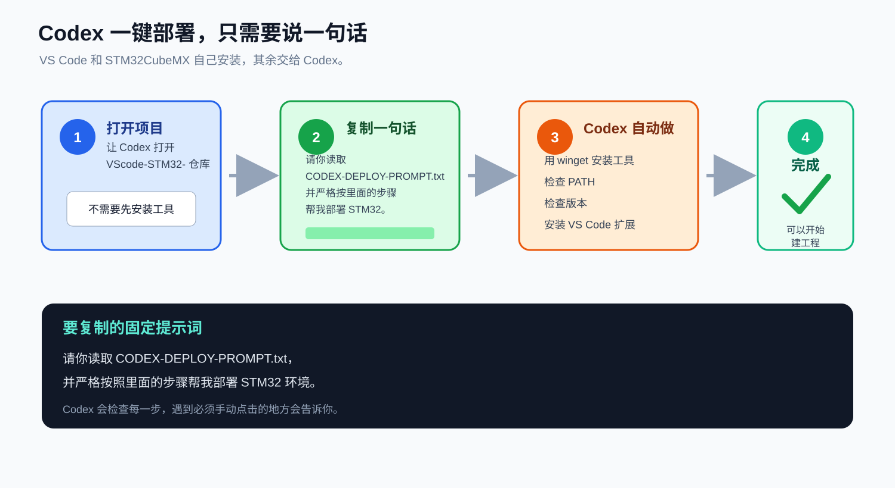
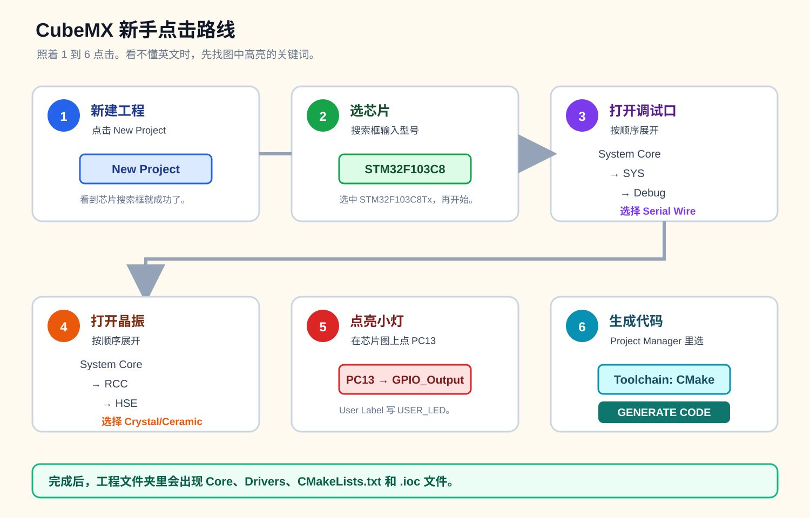
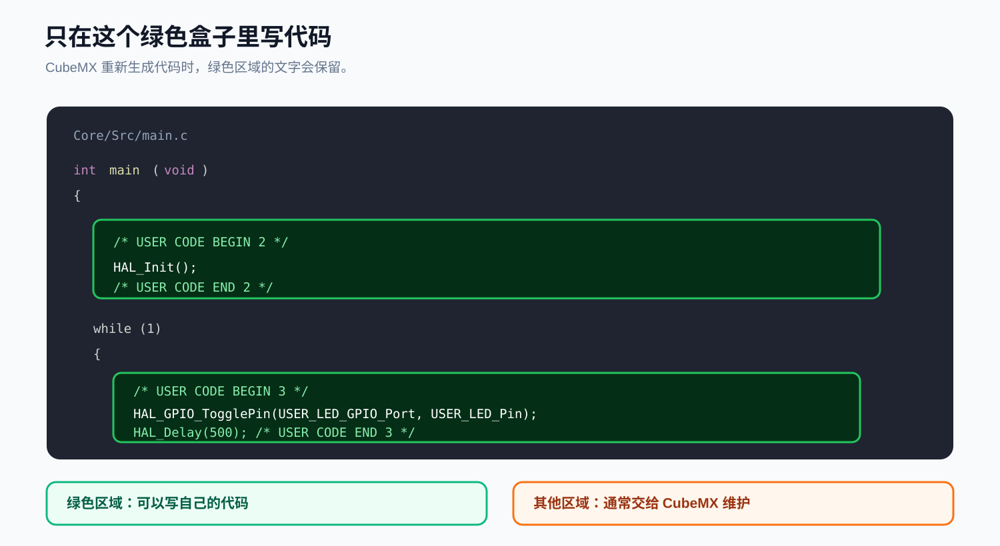
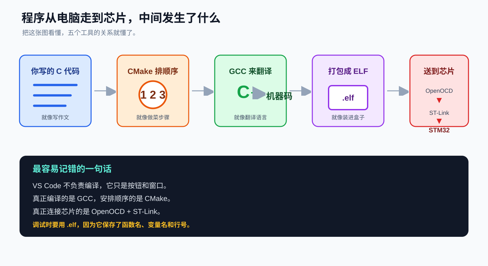

# 12 岁也能看懂的 STM32 + VS Code 教程

[返回首页](./README.md) | [快速部署说明](./QUICK-DEPLOY.md)

如果你第一次听说 STM32、编译器、CMake、OpenOCD，不要怕。  
这不是一门需要先背很多词的课。你只要知道每个工具像什么、负责什么，然后照着图片做。

遇到看不懂的字，直接把那一句复制给 Codex，并说：

```text
请用 12 岁能听懂的话解释这一句，然后告诉我下一步点哪里。
```

## 先记住一句话


STM32 开发就像一条小工厂流水线：

```text
CubeMX 画图纸
  -> CMake 排队
  -> GCC 翻译
  -> OpenOCD 和 ST-Link 把程序送进芯片
  -> VS Code 给你按钮和窗口
```

## 1. 每个工具是干什么的

### STM32CubeMX：画图纸的机器人

你告诉它：

- 我用的芯片叫 `STM32F103C8T6`。
- 我要打开 SWD 调试口。
- 我要用外部晶振。
- 我要让 `PC13` 控制 LED。

它会自动生成一套 C 代码。

你不用从一张白纸开始写所有初始化代码。

### arm-none-eabi-gcc：翻译官

你写的代码长这样：

```c
HAL_GPIO_TogglePin(USER_LED_GPIO_Port, USER_LED_Pin);
```

但 STM32 看不懂英文字母。它只懂机器指令。

GCC 的工作就是把你写的 C 语言翻译成 ARM 芯片能执行的语言。

### CMake：施工队长

一个工程有很多文件。谁先编译，谁后编译，最后怎么连接起来，需要有人安排。

CMake 就是施工队长。它不会亲自翻译，但它会告诉 GCC：

```text
先做 main.c
再做 system_stm32f1xx.c
再处理启动文件
最后把它们连接成 .elf
```

### OpenOCD：电脑和芯片之间的桥

电脑不能直接用一根 USB 线控制 STM32 的 CPU。

OpenOCD 负责：

- 接收电脑发来的烧录命令。
- 把命令转换成 ST-Link 能理解的操作。
- 把程序送进 STM32。
- 让 CPU 暂停、继续、单步执行。

### ST-Link：USB 转 SWD 的小盒子

ST-Link 是一块实际的小硬件。它一边插在电脑 USB 上，另一边接开发板的 SWD 引脚。

你可以把它理解成：

```text
电脑说 USB 语言
芯片说 SWD 语言
ST-Link 负责当翻译插座
```

### VS Code：总控制台

VS Code 是你看代码、点按钮、按 `F5` 的地方。

但它不负责编译，也不负责烧录。真正的编译和烧录是 GCC、CMake、OpenOCD 在做。

### Codex：电脑小老师

Codex 可以帮你：

- 使用 `winget` 安装工具。
- 检查 PATH。
- 安装 VS Code 扩展。
- 检查哪个工具没有装好。
- 把陌生错误翻译成简单话。

## 2. 你只需要自己安装两个软件

### 第一个：VS Code

下载地址：

```text
https://code.visualstudio.com/
```

安装时保持默认选项即可。

### 第二个：STM32CubeMX

下载地址：

```text
https://www.st.com/en/development-tools/stm32cubemx.html
```

安装后第一次打开，需要下载 `STM32F1` 固件包。

### 其他工具不用下载

Codex 会用 Windows 自带的 `winget` 自动安装：

- GCC
- CMake
- Ninja
- OpenOCD

安装位置由 `winget` 自动决定，你不需要记路径。

## 3. 让 Codex 自动装工具



### 第一步：在 Codex 中打开本仓库

仓库地址：

```text
https://github.com/MaiXiangBao/VScode-STM32-
```

### 第二步：复制这句话给 Codex

```text
请你读取 CODEX-DEPLOY-PROMPT.txt，并严格按照里面的步骤帮我部署 STM32 环境。
```

### 第三步：不要自己做其他事

Codex 会先检查你的电脑，然后一步步告诉你：

```text
现在正在使用 winget 安装工具
现在正在检查 PATH
现在正在检查 GCC
现在正在安装 VS Code 扩展
```

如果 Codex 说：

```text
请手动安装 STM32CubeMX
```

你就去安装。安装完成后告诉 Codex：

```text
STM32CubeMX 已经安装好了，请继续。
```

### 完成时你应该看到

Codex 最后会说四个工具都检查通过。类似：

```text
arm-none-eabi-gcc 14.3.1
cmake version 4.4.0
ninja 1.13.2
Open On-Chip Debugger 0.12.0
```

### 如果不想用 Codex

打开 PowerShell，进入本仓库后运行：

```powershell
powershell -ExecutionPolicy Bypass -File .\scripts\install-stm32-tools.ps1
```

## 4. 用 CubeMX 点出一个工程



### 第 1 步：新建工程

打开 STM32CubeMX，点击：

```text
New Project
```

### 第 2 步：选择芯片

在搜索框输入：

```text
STM32F103C8
```

选择：

```text
STM32F103C8Tx
```

点击开始创建工程。

### 第 3 步：打开 SWD

在左边找到：

```text
System Core
  -> SYS
```

把 `Debug` 改成：

```text
Serial Wire
```

### 第 4 步：打开外部晶振

在左边找到：

```text
System Core
  -> RCC
```

把 `High Speed Clock (HSE)` 改成：

```text
Crystal/Ceramic Resonator
```

### 第 5 步：配置 LED

在芯片图上找到 `PC13`：

1. 左键点击 `PC13`。
2. 选择 `GPIO_Output`。
3. 右键选择 `Enter User Label`。
4. 输入：

   ```text
   USER_LED
   ```

### 第 6 步：设置工程

点击 `Project Manager`。

填写：

| 项目 | 填什么 |
| --- | --- |
| Project Name | `stm32f103c8t6-blink` |
| Project Location | `C:\STM32\Projects` |
| Toolchain / IDE | `CMake` |

然后点击：

```text
GENERATE CODE
```

### 如果你找不到 CMake

说明你的 CubeMX 版本比较旧。先选择：

```text
Makefile
```

然后让 Codex 帮你处理。对 Codex 说：

```text
我的 CubeMX 没有 CMake 选项，我选了 Makefile。请阅读 docs/05-cmake-template.md，帮我换成 CMake 工程。
```

## 5. 只在这个绿色区域写代码



CubeMX 重新生成代码时，只会保留 `USER CODE BEGIN` 和 `USER CODE END` 之间的内容。

打开：

```text
Core/Src/main.c
```

找到：

```c
/* USER CODE BEGIN WHILE */
while (1)
{
  /* USER CODE END WHILE */

  /* USER CODE BEGIN 3 */
}
/* USER CODE END 3 */
```

把 `while` 里面改成：

```c
/* USER CODE BEGIN WHILE */
while (1)
{
  HAL_GPIO_TogglePin(USER_LED_GPIO_Port, USER_LED_Pin);
  HAL_Delay(500);

  /* USER CODE END WHILE */

  /* USER CODE BEGIN 3 */
}
/* USER CODE END 3 */
```

这两行代码的意思是：

```text
把 LED 开关一次
等 500 毫秒
再重复
```

## 6. 让 Codex 把 VS Code 配置放进工程

在 Codex 中说：

```text
我已经用 STM32CubeMX 生成了 C:\STM32\Projects\stm32f103c8t6-blink。
请运行 prepare-stm32-project.ps1，把 VS Code、CMake 和 OpenOCD 配置复制进去，并检查工程名和 ELF 路径。
```

Codex 会运行：

```powershell
powershell -ExecutionPolicy Bypass -File .\scripts\prepare-stm32-project.ps1 `
  -ProjectPath "C:\STM32\Projects\stm32f103c8t6-blink"
```

完成后，工程里会出现：

```text
.vscode
CMakePresets.json
openocd
```

## 7. 在 VS Code 里点四个按钮


### 动作 1：打开文件夹

VS Code 菜单：

```text
File
  -> Open Folder
```

选择：

```text
C:\STM32\Projects\stm32f103c8t6-blink
```

不要只打开 `main.c`。

### 动作 2：安装扩展

按：

```text
Ctrl+Shift+X
```

搜索并安装：

- `C/C++`
- `CMake`
- `CMake Tools`
- `Cortex-Debug`

### 动作 3：构建

按：

```text
Ctrl+Shift+P
```

输入：

```text
Tasks: Run Task
```

依次运行：

```text
CMake: configure (Debug)
CMake: build (Debug)
```

构建成功后，应该能找到：

```text
build\Debug\stm32f103c8t6-blink.elf
```

### 动作 4：调试

给这一行左边点一下，放一个红点：

```c
HAL_GPIO_TogglePin(USER_LED_GPIO_Port, USER_LED_Pin);
```

然后按：

```text
F5
```

如果程序停在红点上，说明调试成功了。

## 8. 连接 ST-Link 的四根线


至少连接：

| ST-Link | STM32 开发板 |
| --- | --- |
| 3.3V | 3V3 |
| GND | GND |
| SWDIO | PA13 |
| SWCLK | PA14 |

可选：

```text
RST -> NRST
```

注意：

- `3.3V` 不是 `5V`。
- 如果开发板已经用 USB 供电，不要再让 ST-Link 同时从 `3.3V` 强供电。
- 不同开发板的引脚位置可能不同，要看板子原理图。

## 9. 程序是怎样跑到芯片里的



按下 `F5` 后，顺序是：

1. CMake 检查哪些文件需要重新编译。
2. GCC 把 C 代码编译成机器码。
3. 链接器把它们连接成一个 `.elf`。
4. Cortex-Debug 启动 OpenOCD。
5. OpenOCD 通过 ST-Link 找到 STM32。
6. 程序被写进芯片 Flash。
7. 芯片停在断点，VS Code 显示变量和调用栈。

## 10. 成功的标志

如果下面这些都能做到，你已经完成了第一课：

- [ ] Codex 检查出四个工具版本。
- [ ] CubeMX 能生成工程。
- [ ] VS Code 能运行 CMake 构建。
- [ ] `build/Debug` 里有 `.elf`。
- [ ] OpenOCD 能找到 ST-Link。
- [ ] 按 `F5` 后程序停在断点。
- [ ] 继续运行后，Blue Pill 的 LED 每 500 毫秒闪一次。

## 11. 遇到错误时，不要慌

### 如果是文字看不懂

对 Codex 说：

```text
请把这句话翻译成 12 岁能听懂的话。
```

### 如果是命令找不到

对 Codex 说：

```text
PowerShell 说 arm-none-eabi-gcc 不是内部或外部命令。请检查 winget 安装结果和 PATH，并帮我修好。
```

### 如果是 CMake 失败

对 Codex 说：

```text
请查看 VS Code Terminal 里的完整错误。先只修第一条 error，不要让我同时改很多地方。
```

### 如果是 OpenOCD 连不上

对 Codex 说：

```text
OpenOCD 找不到 ST-Link。请按以下顺序检查：USB、ST-Link 驱动、3.3V、GND、SWDIO、SWCLK、OpenOCD scripts 路径。
```

### 如果是 LED 不亮

对 Codex 说：

```text
程序能烧录，但 PC13 的 LED 不亮。请帮我检查 GPIO 配置、时钟、HAL_Delay 和程序是否停在 HardFault。
```

## 12. 什么时候看进阶教程

你已经完成“能编译、能烧录、能调试”以后，再学习下面这些：

- 芯片宏定义是什么。
- CMake 的 `-mcpu` 怎么改。
- 链接脚本为什么决定 Flash 和 RAM。
- 怎样换到 F4、G0、H7。
- 怎样看 `.map` 文件。
- 怎样写更复杂的驱动。

进阶入口：

- [01 安装工具](./docs/01-install-tools.md)
- [02 CubeMX 工程](./docs/02-create-cubemx-project.md)
- [03 VS Code 配置](./docs/03-vscode-project.md)
- [04 构建、烧录与调试](./docs/04-build-flash-debug.md)
- [05 CMake 模板](./docs/05-cmake-template.md)
- [06 故障排查](./docs/06-troubleshooting.md)
- [07 命令速查](./docs/07-cheatsheet.md)

## 最后记住

```text
先点通，再理解。
先会做，再学为什么。
遇到错误，把原话告诉 Codex。
```

你不需要一次记住所有工具。跟着图片完成一次，第二次自然会更快。
