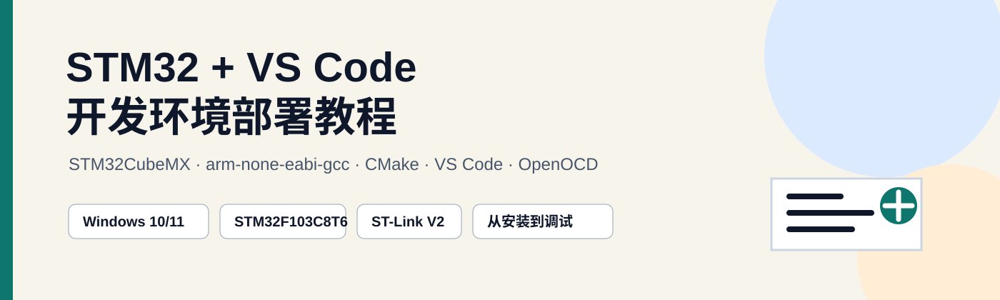
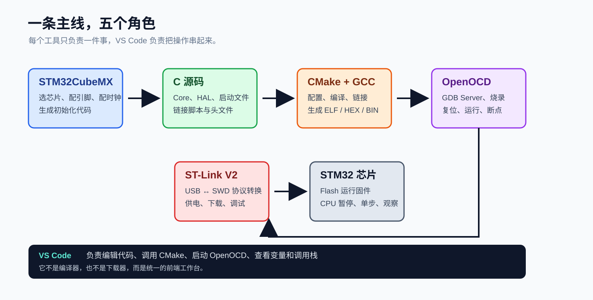
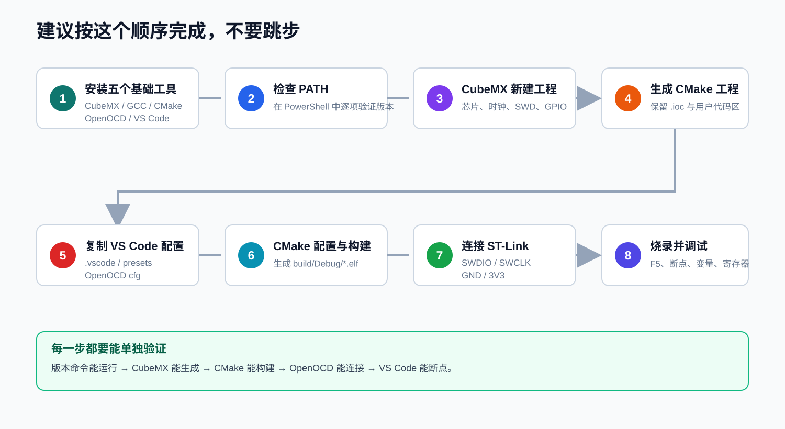
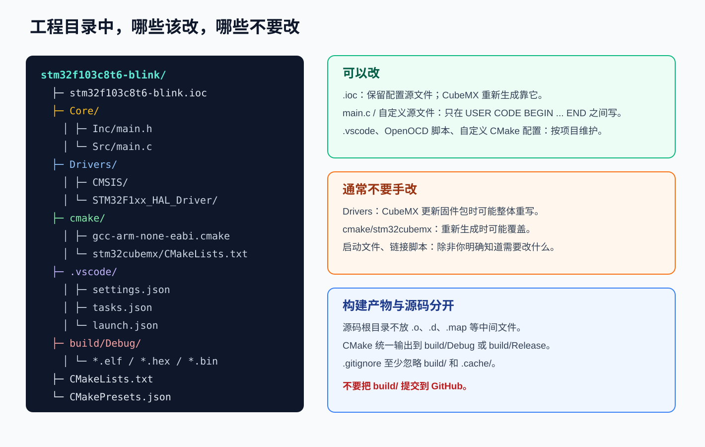
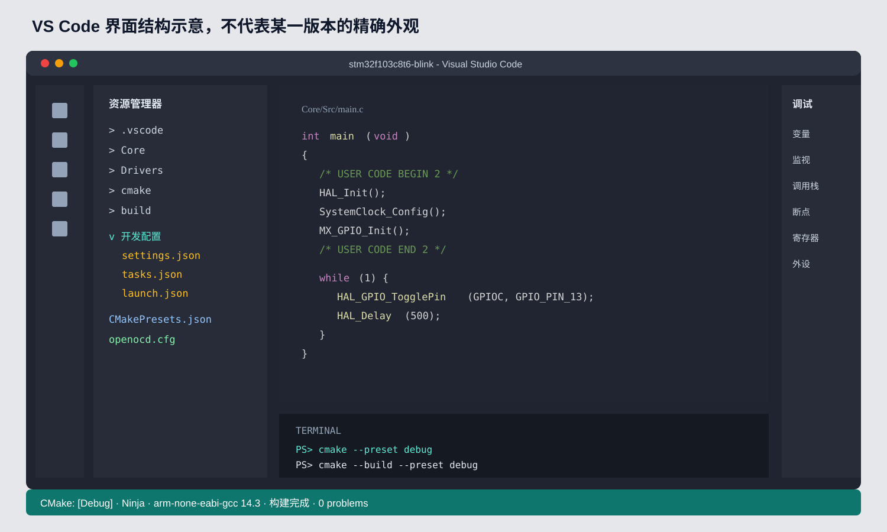
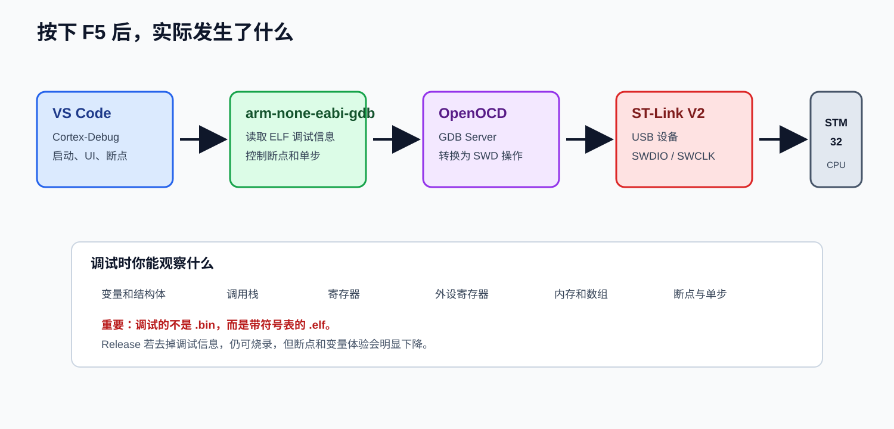
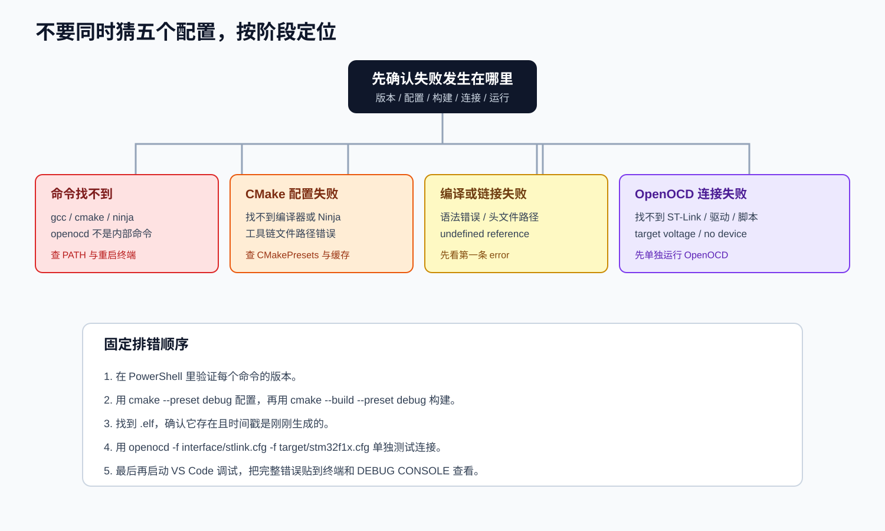

<div align="center">
  
</div>

# STM32 + VS Code 开发环境部署教程

[](./docs/01-install-tools.md)
[](./docs/02-create-cubemx-project.md)
[](./docs/04-build-flash-debug.md)
[](./docs/04-build-flash-debug.md)

这是一份面向初学者的完整教程，讲解如何在 Windows 上使用：

- `STM32CubeMX`
- `arm-none-eabi-gcc`
- `CMake` + `Ninja`
- `Visual Studio Code`
- `OpenOCD` + `Cortex-Debug`

完成一次“新建工程、编写代码、编译、烧录、断点调试”的完整闭环。

教程默认使用 `STM32F103C8T6`（Blue Pill）和 `ST-Link V2` 举例。其他 STM32 芯片的流程基本相同，但需要修改芯片型号、C 宏定义、CPU 编译参数、链接脚本和 OpenOCD target 配置。

## 教程目标

跟着教程完成后，你应该能够：

1. 在 PowerShell 中独立验证 GCC、CMake、Ninja、OpenOCD 和 VS Code。
2. 使用 STM32CubeMX 配置芯片、时钟、SWD 调试口和 GPIO。
3. 生成一个可以用 CMake 构建的 STM32 工程。
4. 在 VS Code 中正确配置代码提示、构建任务和调试任务。
5. 编译出 `.elf`、`.hex`、`.bin`、`.map` 文件。
6. 使用 OpenOCD 烧录固件。
7. 使用 Cortex-Debug 设置断点、单步、查看变量、寄存器和调用栈。
8. 根据“版本、配置、构建、连接、运行”五个阶段定位常见错误。

## 最终工具链



| 工具 | 负责什么 | 常见安装位置 |
| --- | --- | --- |
| STM32CubeMX | 图形化配置芯片并生成初始化代码 | `C:\ST\STM32CubeMX` 或自定义目录 |
| ARM GNU Toolchain | 把 C/汇编源码编译成 ARM Cortex-M 目标代码 | `C:\Program Files (x86)\Arm GNU Toolchain arm-none-eabi\...` |
| CMake | 描述工程如何构建，生成 Ninja 或 Makefile 构建文件 | `C:\Program Files\CMake\bin` |
| Ninja | 实际执行编译和链接，速度快 | `C:\Tools\ninja` |
| OpenOCD | 连接 ST-Link，提供烧录和 GDB Server | `C:\Tools\xpack-openocd\bin` |
| VS Code | 编辑、任务、调试和扩展宿主 | 用户级安装目录 |
| Cortex-Debug | 把 GDB/OpenOCD 接入 VS Code 调试界面 | VS Code 扩展 |

建议把所有工具安装到简短、无中文、无空格的路径，例如：

```text
C:\Tools\arm-gnu-toolchain
C:\Tools\cmake
C:\Tools\ninja
C:\Tools\xpack-openocd
C:\STM32\STM32CubeMX
```

## 推荐阅读顺序



| 章节 | 内容 | 完成后应看到的证据 |
| --- | --- | --- |
| [01 安装工具](./docs/01-install-tools.md) | 安装、PATH、VS Code 扩展、版本检查 | 五条版本命令都能运行 |
| [02 新建 CubeMX 工程](./docs/02-create-cubemx-project.md) | 选芯片、配置时钟、SWD、GPIO、生成 CMake 工程 | 生成 `Core/`、`Drivers/`、`.ioc` |
| [03 配置 VS Code](./docs/03-vscode-project.md) | `.vscode`、代码提示、CMake Presets、任务 | CMake 配置成功 |
| [04 构建、烧录与调试](./docs/04-build-flash-debug.md) | 编译、OpenOCD、ST-Link 接线、断点 | 开发板 LED 闪烁且能停在断点 |
| [05 CMake 模板详解](./docs/05-cmake-template.md) | 工具链文件、宏、链接脚本、手工 CMake 后备方案 | 能看懂并修改关键参数 |
| [06 故障排查](./docs/06-troubleshooting.md) | 高频错误、原因、检查命令和修复方法 | 能独立定位大部分环境问题 |
| [07 命令速查表](./docs/07-cheatsheet.md) | 命令、扩展 ID、芯片配置对照、快捷键 | 可以快速复制使用 |

## 五分钟快速路径

如果你已经安装好所有工具，可以按下面的顺序直接开始：

```powershell
# 1. 在一个简短路径下新建工程目录
mkdir C:\STM32\stm32f103c8t6-blink
cd C:\STM32\stm32f103c8t6-blink

# 2. 用 STM32CubeMX 新建该目录下的工程
# Project Manager -> Toolchain/IDE 选择 CMake
# 然后 Generate Code

# 3. 复制本仓库的模板
Copy-Item C:\path\to\this\repo\templates\.vscode .\.vscode -Recurse
Copy-Item C:\path\to\this\repo\templates\CMakePresets.json .
Copy-Item C:\path\to\this\repo\templates\cmake .\cmake -Recurse -Force
Copy-Item C:\path\to\this\repo\templates\openocd .\openocd -Recurse

# 4. 配置与构建
cmake --preset debug
cmake --build --preset debug

# 5. 检查固件
Get-ChildItem .\build\Debug -Filter *.elf
```

然后：

1. 按 [04 构建、烧录与调试](./docs/04-build-flash-debug.md) 接线。
2. 先单独运行 OpenOCD 验证 ST-Link。
3. 在 VS Code 中按 `F5` 进入调试。

> 注意：如果你的 CubeMX 版本已经生成自己的 `cmake/gcc-arm-none-eabi.cmake`，不要盲目覆盖。先对比路径和文件名，只替换需要改变的内容。

## 示例硬件


| 项目 | 示例 |
| --- | --- |
| 开发板 | STM32F103C8T6 Blue Pill |
| 调试器 | ST-Link V2 或兼容版 |
| 连接方式 | SWD |
| 必接信号 | `3.3V`、`GND`、`SWDIO`、`SWCLK` |
| 可选信号 | `NRST` |
| 示例 LED | `PC13`，Blue Pill 上通常为低电平点亮 |
| OpenOCD interface | `interface/stlink.cfg` |
| OpenOCD target | `target/stm32f1x.cfg` |

不同 board 和芯片的替换关系：

| 芯片系列 | 常见 OpenOCD target | C 宏示例 | CPU 示例 |
| --- | --- | --- | --- |
| STM32F1 | `target/stm32f1x.cfg` | `STM32F103xB` | `-mcpu=cortex-m3 -mthumb` |
| STM32F4 | `target/stm32f4x.cfg` | `STM32F407xx` | `-mcpu=cortex-m4 -mthumb -mfpu=fpv4-sp-d16 -mfloat-abi=hard` |
| STM32G0 | `target/stm32g0x.cfg` | `STM32G030xx` | `-mcpu=cortex-m0plus -mthumb` |
| STM32H7 | `target/stm32h7x.cfg` | `STM32H743xx` | `-mcpu=cortex-m7 -mthumb -mfpu=fpv5-d16 -mfloat-abi=hard` |

## 工程结构



典型 CubeMX CMake 工程如下：

```text
stm32f103c8t6-blink/
├─ stm32f103c8t6-blink.ioc
├─ CMakeLists.txt
├─ CMakePresets.json
├─ cmake/
│  ├─ gcc-arm-none-eabi.cmake
│  └─ stm32cubemx/
│     └─ CMakeLists.txt
├─ Core/
│  ├─ Inc/
│  └─ Src/
├─ Drivers/
│  ├─ CMSIS/
│  └─ STM32F1xx_HAL_Driver/
├─ .vscode/
│  ├─ settings.json
│  ├─ tasks.json
│  └─ launch.json
├─ openocd/
│  └─ stm32f1-stlink.cfg
└─ build/
   └─ Debug/
      ├─ stm32f103c8t6-blink.elf
      ├─ stm32f103c8t6-blink.hex
      ├─ stm32f103c8t6-blink.bin
      └─ stm32f103c8t6-blink.map
```

核心原则：

- `.ioc` 是 CubeMX 的工程源文件，必须保留并提交。
- 用户代码只写在 `/* USER CODE BEGIN ... */` 和 `/* USER CODE END ... */` 之间。
- `Drivers/` 和 CubeMX 生成的构建描述通常由工具维护。
- `build/` 是本机构建产物，不要提交到 GitHub。

## VS Code 中应该看到什么



这个图是界面结构示意，不是实际截图。实际颜色、图标和位置会因 VS Code 主题、版本及扩展而变化。判断配置是否成功，不看“长得像不像”，而看：

- 打开 `.c` 文件后，头文件不应该出现大面积红色波浪线。
- CMake Tools 能识别 `Debug` preset。
- 任务列表中可以运行 `CMake: configure` 和 `CMake: build`。
- 调试侧栏能看到变量、监视、调用栈、断点和寄存器。
- 集成终端中的 `arm-none-eabi-gcc`、`cmake`、`openocd` 都可以直接运行。

## 构建和调试链路



一次典型调试是这样工作的：

1. CMake 调用 `arm-none-eabi-gcc` 编译源码。
2. 链接器根据 `.ld` 文件把代码和数据分配到 Flash/RAM。
3. 输出带调试符号的 `.elf`，并可选生成 `.hex`、`.bin`。
4. Cortex-Debug 启动 OpenOCD。
5. OpenOCD 通过 ST-Link 和 SWD 连接 STM32。
6. GDB 加载 `.elf`，设置断点并控制 CPU。
7. VS Code 显示变量、调用栈、寄存器和外设。

调试必须使用 `.elf`。`.bin` 只包含原始二进制，没有源码行号、变量名和符号表，不适合作为 Cortex-Debug 的可执行文件。

## 排错原则



遇到问题时，不要同时修改五个配置。按下面顺序逐层验证：

```text
命令是否存在
  -> CMake 是否能配置
  -> 源码是否能编译和链接
  -> ELF 是否生成
  -> OpenOCD 是否能连接
  -> VS Code 是否能启动 GDB
  -> 程序运行逻辑是否正确
```

每一步都单独运行，拿到第一条真正的错误信息。详细处理见 [06 故障排查](./docs/06-troubleshooting.md)。

## 模板文件

本仓库提供了可以直接参考的模板：

```text
templates/
├─ .vscode/
│  ├─ extensions.json
│  ├─ settings.json
│  ├─ tasks.json
│  └─ launch.json
├─ cmake/
│  └─ gcc-arm-none-eabi.cmake
├─ openocd/
│  └─ stm32f1-stlink.cfg
├─ CMakeLists.txt
└─ CMakePresets.json
```

模板中可能出现以下占位符：

| 占位符 | 替换成 |
| --- | --- |
| `<工程名>` | CubeMX 工程名，例如 `stm32f103c8t6-blink` |
| `<OpenOCD scripts 目录>` | OpenOCD 的 `scripts` 或 `openocd/scripts` 目录 |
| `<ARM GNU Toolchain 目录>` | ARM GCC 安装目录，例如 `C:/Tools/arm-gnu-toolchain` |
| `<CPU 编译参数>` | 例如 `-mcpu=cortex-m3 -mthumb` |
| `<C 宏定义>` | 例如 `STM32F103xB;USE_HAL_DRIVER` |
| `<链接脚本>` | 例如 `STM32F103C8Tx_FLASH.ld` |

## 发布到 GitHub 前检查

```powershell
git init -b main
git add .
git commit -m "docs: add STM32 VS Code development tutorial"
git remote add origin https://github.com/<你的用户名>/<仓库名>.git
git push -u origin main
```

提交前请确认：

- 不要提交 `build/`、`.cache/`、本机绝对路径截图和 ST-Link 序列号。
- 如果录屏或截图里出现用户名，先打码或裁掉。
- 仓库根目录保留 `README.md`，GitHub 会自动展示。
- SVG 图片放在 `assets/diagrams/`，命名使用英文小写和连字符。
- 如果引用第三方图片，注明来源和许可证。

## 参考入口

- [STMicroelectronics STM32CubeMX](https://www.st.com/en/development-tools/stm32cubemx.html)
- [Arm GNU Toolchain Downloads](https://developer.arm.com/downloads/-/arm-gnu-toolchain-downloads)
- [CMake Download](https://cmake.org/download/)
- [Ninja Releases](https://github.com/ninja-build/ninja/releases)
- [OpenOCD](https://openocd.org/)
- [xPack OpenOCD Releases](https://github.com/xpack-dev-tools/openocd-xpack/releases)
- [Visual Studio Code](https://code.visualstudio.com/)
- [Cortex-Debug Extension](https://marketplace.visualstudio.com/items?itemName=marus25.cortex-debug)
- [CMake Tools Extension](https://marketplace.visualstudio.com/items?itemName=ms-vscode.cmake-tools)

---

如果本教程对你的课程或社团有帮助，可以继续补充自己学校的开发板型号、ST-Link 接线照片和真实截图。
