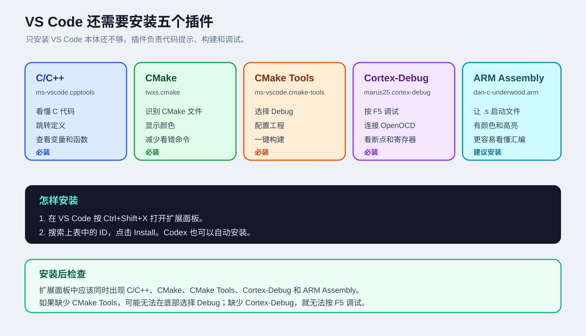

<div align="center">
  
</div>

# 12 岁也能看懂的 STM32 开发环境

这份教程不讲一长串难懂名词。它会先告诉你：

1. 每个工具像什么、负责什么。
2. 它们怎样一个接一个地工作。
3. 你只需要点哪里。
4. 出错时怎样让 Codex 帮你翻译和修复。

## 你只需要自己安装两个软件

| 软件 | 为什么要自己安装 |
| --- | --- |
| [VS Code](https://code.visualstudio.com/) | 这是你看代码和点按钮的地方 |
| [STM32CubeMX](https://www.st.com/en/development-tools/stm32cubemx.html) | 这是你选择芯片和生成工程的地方 |

其他工具由 Codex 自动安装：

- `arm-none-eabi-gcc`
- `CMake`
- `Ninja`
- `OpenOCD`

Codex 会调用 Windows 自带的 `winget`，不需要你自己去官网找。

## VS Code 还必须安装这些插件



| 插件 | 扩展 ID | 作用 | 是否必须 |
| --- | --- | --- | --- |
| C/C++ | `ms-vscode.cpptools` | 代码提示、跳转定义、查看函数和变量 | 必须 |
| CMake | `twxs.cmake` | 让 `CMakeLists.txt` 有颜色和语法提示 | 必须 |
| CMake Tools | `ms-vscode.cmake-tools` | 选择 Debug、配置工程、构建工程 | 必须 |
| Cortex-Debug | `marus25.cortex-debug` | 按 `F5`、连接 OpenOCD、设置断点、看寄存器 | 必须 |
| ARM Assembly | `dan-c-underwood.arm` | 让启动文件 `.s` 更容易阅读 | 建议 |

安装方法：

1. 在 VS Code 中按 `Ctrl+Shift+X`。
2. 搜索上表中的扩展 ID。
3. 点击 `Install`。
4. 安装完成后按提示重新加载 VS Code。

也可以让 Codex 自动安装。部署脚本会执行对应的 `code --install-extension` 命令。

## 最简单的开始方法

### 第 1 步：在 Codex 打开这个项目

仓库地址：

```text
https://github.com/MaiXiangBao/Vscode-STM32-Development-environment
```

### 第 2 步：把这句话复制给 Codex

```text
请你读取 CODEX-DEPLOY-PROMPT.txt，并严格按照里面的步骤帮我部署 STM32 环境。
```

Codex 会自动做：

1. 检查 VS Code 和 STM32CubeMX。
2. 使用 `winget` 安装 Arm GNU Toolchain。
3. 使用 `winget` 安装 CMake、Ninja 和 OpenOCD。
4. 安装 VS Code 扩展。
5. 检查 GCC、CMake、Ninja、OpenOCD。

### 第 3 步：打开新手图解教程

[打开 BEGINNER-GUIDE.md](./BEGINNER-GUIDE.md)

它会从“什么是 CubeMX”开始，一直教到“按 F5 停在断点”。

## 先看这张图


你只要记住：

```text
CubeMX 画图纸
CMake 安排顺序
GCC 翻译代码
OpenOCD 和 ST-Link 把程序送进芯片
VS Code 给你按钮和窗口
Codex 帮你把环境装好并解释错误
```

## 30 秒版本

```text
安装 VS Code 和 CubeMX
  -> 在 Codex 中粘贴部署提示词
  -> 用 CubeMX 点击生成工程
  -> 让 Codex 复制 VS Code 配置
  -> 用 VS Code 打开工程
  -> 运行 CMake configure/build
  -> 连接 ST-Link
  -> 按 F5
```

## 目录

| 文档 | 适合什么时候看 |
| --- | --- |
| [QUICK-DEPLOY.md](./QUICK-DEPLOY.md) | 只想先让 Codex 把工具装好 |
| [BEGINNER-GUIDE.md](./BEGINNER-GUIDE.md) | 第一次创建和调试 STM32 工程 |
| [01 安装工具](./docs/01-install-tools.md) | 想手动安装每个工具 |
| [02 CubeMX 工程](./docs/02-create-cubemx-project.md) | 想更仔细了解 CubeMX 设置 |
| [03 VS Code 配置](./docs/03-vscode-project.md) | 想了解每个 JSON 配置 |
| [04 构建、烧录与调试](./docs/04-build-flash-debug.md) | 想学习命令和 OpenOCD |
| [05 CMake 模板](./docs/05-cmake-template.md) | 想换芯片或理解 CMake |
| [06 故障排查](./docs/06-troubleshooting.md) | 出现具体错误时 |
| [07 命令速查](./docs/07-cheatsheet.md) | 已经会基本操作后 |

## 如果不想使用 Codex

打开 PowerShell，进入仓库目录后运行：

```powershell
powershell -ExecutionPolicy Bypass -File .\scripts\install-stm32-tools.ps1
```

然后检查：

```powershell
powershell -ExecutionPolicy Bypass -File .\scripts\check-stm32-tools.ps1
```

## 最适合新手的四个图片

### 工具小队


### Codex 自动部署


### CubeMX 点击路线


### VS Code 四个动作


## 遇到错误时只需要说

```text
请用 12 岁能听懂的话解释这个错误，然后一次只让我改一个地方。
```

先把环境跑通，再慢慢理解底层原理。第一次成功比一次记住所有知识更重要。
