# 从零搭建 VS Code 的 STM32 开发环境：STM32F103C8T6 图文教程

**STM32F103C8T6 · Windows 10/11 · STM32CubeMX · Arm GNU Toolchain · CMake · Ninja · OpenOCD · ST-LINK**

这份教程面向第一次搭建 STM32 开发环境的读者。我们会从安装软件开始，以 STM32F103C8T6 最小系统板为例，生成一个 PC13 LED 闪烁工程，再完成编译、烧录和断点调试。每一步都包含操作方法、工具的作用和验收标准。

先纠正一个容易搜错的名字：ST 的图形配置工具叫 **STM32CubeMX**，本文简称 CubeMX。搜索下载时请使用这个名字。

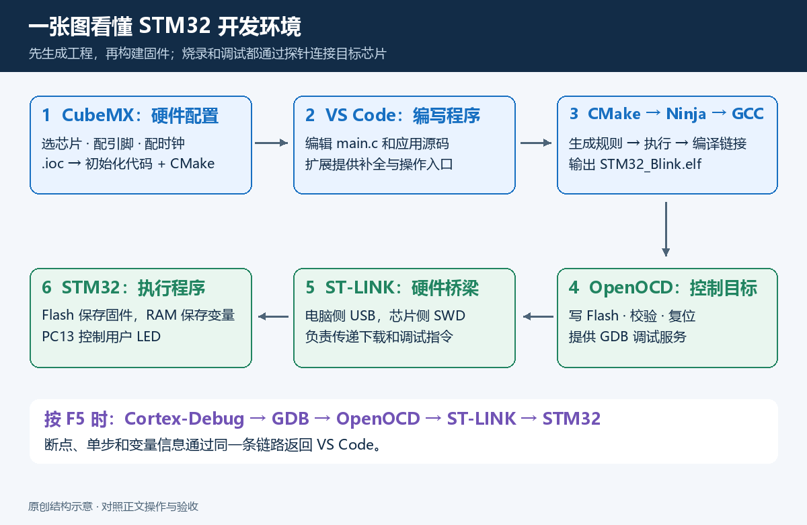

**读完并完成操作后，你应该能够：**

- 用 CubeMX 选择芯片、配置 GPIO 和时钟，生成 CMake 工程。
- 在 VS Code 中获得代码补全，并按 `Ctrl + Shift + B` 编译。
- 把生成的固件通过 ST-LINK 下载到开发板。
- 按 `F5` 启动调试，在 C 代码中打断点、单步执行、查看变量。
- 解释为什么安装了编辑器，还需要编译器、构建工具和调试服务器。

> 本文整理日期：2026-10-01。软件界面会随版本变化；菜单位置略有不同，请按文中给出的英文功能名称定位。配图中的操作示意会明确标注，不能代替真实界面截图。
>
> 验证范围和实际版本记录见 [验证记录](docs/verification.md)。硬件验收以你自己的开发板上 LED 闪烁、断点命中为准。

## 阅读导航

1. [先弄清楚每个工具负责什么](#tools)
2. [准备硬件、目录和安装包](#prepare)
3. [安装 VS Code 和扩展](#vscode)
4. [安装 CubeMX 和 STM32 固件包](#cubemx-install)
5. [安装 GCC、CMake、Ninja、OpenOCD](#toolchain)
6. [配置 PATH 并检查安装结果](#path)
7. [用 CubeMX 创建第一个工程](#new-project)
8. [在 VS Code 中打开、配置和编译](#build)
9. [添加 LED 闪烁代码](#blink)
10. [连接开发板并烧录](#flash)
11. [配置 VS Code 一键编译和烧录](#tasks)
12. [启动断点调试](#debug)
13. [日常开发、换芯片与重新生成代码](#daily)
14. [按现象排查常见问题](#troubleshooting)
15. [整理并上传 GitHub](#github)
16. [官方资料与进一步阅读](#references)

<a id="tools"></a>
## 1. 先弄清楚：这些工具到底在做什么

### 1.1 开发环境是一条合作完成任务的流水线

把 LED 闪烁这个任务拆开来看：

1. **配置硬件**：选择 PC13 做 GPIO 输出，选择系统时钟来源。这一步交给 CubeMX。
2. **编写程序**：编辑 `main.c`，写出什么时候切换 LED 电平。这一步在 VS Code 中完成。
3. **描述构建规则**：哪些源文件要编译，头文件在哪，芯片宏是什么，Flash 和 RAM 如何分配。这些信息写在 CMake 文件和链接脚本里。
4. **执行编译命令**：Ninja 按 CMake 生成的规则调用 Arm GCC，生成固件。
5. **把固件写入芯片**：OpenOCD 通过 ST-LINK，把固件写入 STM32 的 Flash。
6. **观察运行过程**：Cortex-Debug 调用 GDB，GDB 通过 OpenOCD 控制 STM32，显示断点、变量和调用栈。

VS Code 把这些动作集中在一个界面中。编译、下载和调试背后的工作仍由相应工具执行。

### 1.2 工具作用对照表

| 工具 | 负责的工作 | 输入 | 输出或结果 |
|---|---|---|---|
| VS Code | 编辑源码、展示任务和调试界面 | 工程文件、扩展配置 | 保存的源码、操作界面 |
| STM32CubeMX | 配置芯片、引脚、时钟和外设；生成初始化工程 | 硬件配置、`.ioc` | HAL 初始化代码、启动文件、链接脚本、CMake 文件 |
| STM32Cube MCU 固件包 | 提供对应系列的 HAL、LL、CMSIS 和示例 | 所选 STM32 系列 | 例如 `STM32Cube FW_F1` 中的驱动源码 |
| Arm GNU Toolchain | 把 C/C++/汇编转换为 Cortex-M 机器码 | 源码、头文件、编译选项、链接脚本 | `.o`、`.elf`、`.map` 等 |
| CMake | 读取工程描述，生成构建系统 | `CMakeLists.txt`、工具链文件、预设 | `build.ninja`、编译数据库等 |
| Ninja | 根据依赖关系执行构建命令 | `build.ninja` | 调用 GCC，完成增量编译与链接 |
| OpenOCD | 控制调试探针，下载固件，提供 GDB 服务 | 探针/芯片配置、固件、调试指令 | Flash 写入、复位、暂停、寄存器和内存访问 |
| ST-LINK | 连接电脑与 STM32 的硬件调试探针 | USB 指令 | 经 SWD 与 STM32 通信 |
| ST-LINK USB 驱动 | 让 Windows 上的软件识别和访问 ST-LINK | USB 设备 | 正确枚举的调试设备 |
| C/C++ 扩展 | 代码补全、跳转、语法诊断 | 编译器信息、宏、头文件路径 | 编辑器中的提示 |
| CMake Tools 扩展 | 在 VS Code 中调用 CMake、选择预设、提供编译信息 | CMake 工程 | 配置/构建命令、C/C++ 配置数据 |
| Cortex-Debug 扩展 | 连接 VS Code 调试界面与嵌入式 GDB | `launch.json`、ELF、GDB、OpenOCD | 断点、单步、变量、调用栈 |

CubeMX 原生生成 CMake 工程的功能从 **6.11.0** 开始提供。本文直接使用这一工程格式。[ST 对 CMake 工作流的说明](https://www.st.com/content/st_com/en/campaigns/stm32-vs-code-extension-z11.html)

### 1.3 “工具链”里有什么

安装 Arm GNU Toolchain 后，`bin` 目录里会看到这些程序：

| 程序 | 用途 |
|---|---|
| `arm-none-eabi-gcc` | C 编译器驱动，也可以调用汇编器和链接器 |
| `arm-none-eabi-g++` | C++ 编译器驱动；CubeMX 的工具链配置可能也会检测它 |
| `arm-none-eabi-as` | 汇编器，把汇编文件变为目标文件 |
| `arm-none-eabi-ld` | 链接器，把目标文件组合起来，按链接脚本分配地址 |
| `arm-none-eabi-gdb` | 调试器，读取符号信息并向调试服务器发送指令 |
| `arm-none-eabi-objcopy` | 转换固件格式，例如 ELF 转 BIN 或 HEX |
| `arm-none-eabi-size` | 查看代码和数据占用的空间 |
| `arm-none-eabi-objdump` | 查看反汇编等信息 |

`arm-none-eabi` 表示面向 Arm 裸机目标的工具链。程序在 Windows 上编译，编译出来的机器码运行在 STM32 上，这叫**交叉编译**。电脑上的普通 `gcc.exe` 或 MSVC `cl.exe` 不能直接代替它。

### 1.4 `.ioc`、`.elf`、`.bin` 都是什么

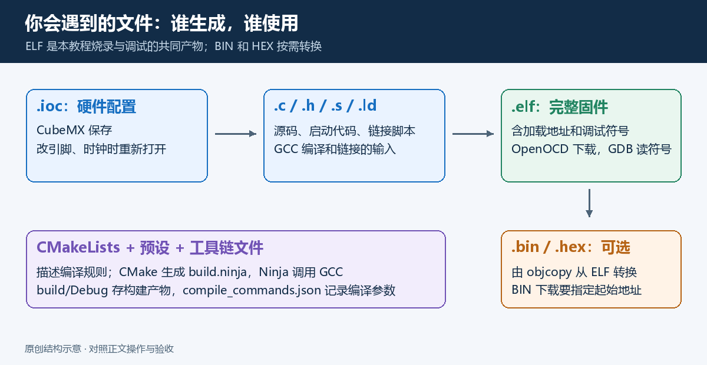

| 文件 | 应该如何理解 |
|---|---|
| `STM32_Blink.ioc` | CubeMX 的硬件配置文件；以后要改引脚、时钟和外设时打开它 |
| `Core/Src/main.c` | 程序入口和本教程的应用代码 |
| `Drivers/` | HAL 和 CMSIS 等依赖源码 |
| `startup_stm32f103xb.s` | 芯片启动代码和中断向量表 |
| `STM32F103XX_FLASH.ld` | 链接脚本，描述 Flash、RAM 和各段的存放位置；以实际生成文件名为准 |
| `CMakeLists.txt` | 工程构建规则 |
| `cmake/gcc-arm-none-eabi.cmake` | 交叉编译工具链配置 |
| `CMakePresets.json` | CubeMX 生成的命名构建配置 |
| `CMakeUserPresets.json` | 本机使用的预设；本文在这里添加自己的 Debug 构建配置 |
| `build/Debug/STM32_Blink.elf` | 链接后的固件，包含地址和调试符号；烧录和调试都用它 |
| `.bin` | 原始二进制数据，文件自身不包含烧录地址 |
| `.hex` | 带地址信息的文本固件格式 |
| `.map` | 链接结果说明，便于分析函数、变量和内存占用 |
| `compile_commands.json` | 每个源文件的真实编译命令，可用于代码补全和分析 |

**本教程直接烧录 ELF，因此不必先生成 BIN 或 HEX。**

### 1.5 为什么选 CMake + Ninja

CMake 负责生成构建规则，Ninja 负责执行规则，GCC 负责真正编译。修改一个 `.c` 文件后，Ninja 通常只重新构建受影响的部分。[Ninja 官方手册](https://ninja-build.org/manual.html)

有些旧教程使用 CubeMX 的 Makefile 工程，那条路线需要 GNU Make。本文选择 CMake 工程，并在预设中固定 Ninja 生成器。按本文配置时，无需额外安装 Make，也无需把 Keil 工程转成另一种格式。

<a id="prepare"></a>
## 2. 准备硬件、目录和安装包

### 2.1 本教程的统一示例

| 项目 | 本文约定 |
|---|---|
| 操作系统 | Windows 10/11，x64 |
| 开发板 | STM32F103C8T6 最小系统板，LQFP48 封装 |
| 调试探针 | 外置 ST-LINK，使用 SWD；另备杜邦线 |
| LED | 常见板子的用户 LED 接 PC13，低电平点亮；先核对原理图 |
| 芯片资源 | Cortex-M3，无 FPU；Flash 64 KB，SRAM 20 KB |
| 启动跳线 | BOOT0 = 0；正常复位后从用户 Flash 启动 |
| 系统时钟 | 内部 HSI 8 MHz；初次验证不启用 PLL 或外部 HSE |
| 工程名称 | `STM32_Blink` |
| 工程位置 | `C:\STM32Projects\STM32_Blink` |
| 工具存放位置 | `C:\STM32Tools` |

准备一块 **STM32F103C8T6 最小系统板**、一个外置 ST-LINK、支持数据传输的 USB 线，以及 SWD 接线用的杜邦线。建议准备 5 根信号线，分别连接 SWDIO、SWCLK、GND、目标电压参考和 NRST；实际针脚定义以你的探针说明为准。板子用 USB 供电时，还要确认其稳压电路能正常提供 3.3 V。

本文假定原理图中的用户 LED 接 **PC13**，结构为 **3.3 V → 限流电阻 → LED → PC13**：PC13 输出低电平时亮，高电平时灭。不同厂家板子可能不同，先核对原理图。电源指示灯通常一直亮，不是本教程控制的 LED。

STM32F103C8T6 的官方容量是 **64 KB Flash、20 KB SRAM**，内部 HSI 为 **8 MHz**。不要把 C8 的链接脚本自行扩成 128 KB。芯片参数见 [ST 数据手册](https://www.st.com/resource/en/datasheet/stm32f103c8.pdf)。更多板级检查和可选 72 MHz 时钟配置见 [F103C8T6 硬件与时钟补充](docs/stm32f103.md)。

### 2.2 软件清单

先收集下面的安装包，再开始安装。ST 下载页面可能要求登录账号或填写下载信息。

| 软件 | 获取位置 | 本文需要的类型 |
|---|---|---|
| VS Code | [微软官方下载](https://code.visualstudio.com/Download) | Windows x64 User Installer 或 System Installer |
| STM32CubeMX | [ST 官方下载](https://www.st.com/en/development-tools/stm32cubemx.html) | Windows 安装包；需支持 CMake/GCC 输出 |
| STM32Cube FW_F1 | CubeMX 的软件包管理器 | 本示例需要 F1 系列固件包 |
| Arm GNU Toolchain | [Arm 官方工具链入口](https://developer.arm.com/downloads/-/arm-gnu-toolchain-downloads)、[Arm 官方项目](https://gitlab.arm.com/tooling/gnu-toolchains-for-arm) | Windows 主机、`arm-none-eabi` 目标 |
| CMake | [CMake 官方下载](https://cmake.org/download/) | Windows x64 安装包或 ZIP |
| Ninja | [Ninja 官方 Releases](https://github.com/ninja-build/ninja/releases) | Windows 可执行程序 ZIP |
| OpenOCD | [xPack OpenOCD Releases](https://github.com/xpack-dev-tools/openocd-xpack/releases) | Windows x64 预编译 ZIP |
| ST-LINK USB 驱动 | [STSW-LINK009](https://www.st.com/en/development-tools/stsw-link009.html) | Windows 驱动包 |
| STM32CubeProgrammer | [ST 官方下载](https://www.st.com/en/development-tools/stm32cubeprog.html) | 可选，用于独立检查连接、下载和升级 ST-LINK |

**版本选择原则：**CubeMX 至少 6.11；CMake 应满足实际生成的 `cmake_minimum_required` 和预设格式要求，本文预设格式 3 需要 CMake 至少 3.21。优先使用 CubeMX 生成文件要求的更高版本。Ninja 使用适配 Windows 的稳定版本。OpenOCD 要支持你的芯片和探针。

本文 OpenOCD 配置按 **xPack OpenOCD 0.12.0-7 的 ST-LINK DAP 驱动**编写。其他发布包可能使用不同的 ST-LINK 脚本，请看 [SWD 与 HLA 的区别](#openocd-transport)。不要仅凭版本号相近就混用配置。

> 安装的是“在 Windows 上运行的工具”，目标是“Arm 裸机”。有些 Arm 工具链 Windows 包的主机字段包含 `mingw-w64-i686`，这不意味着它会给 STM32 生成 x86 程序。关键是目标字段 `arm-none-eabi`。不要误选 `aarch64-none-elf`、`arm-none-linux-gnueabihf` 或 Linux/macOS 安装包。

### 2.3 先固定目录，后面少改配置

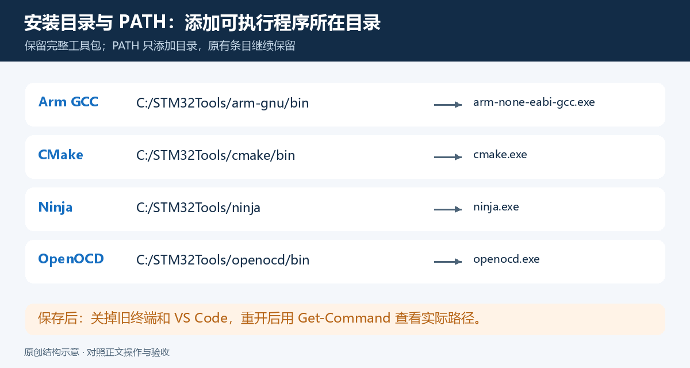

建议最终整理为：

```text
C:\STM32Tools\
├─ arm-gnu\
│  ├─ bin\arm-none-eabi-gcc.exe
│  ├─ arm-none-eabi\
│  └─ lib\ ...
├─ cmake\
│  ├─ bin\cmake.exe
│  └─ share\ ...
├─ ninja\ninja.exe
└─ openocd\
   ├─ bin\openocd.exe
   └─ openocd\scripts\
      ├─ interface\stlink.cfg
      └─ target\stm32f1x.cfg

C:\STM32Projects\STM32_Blink\
```

上面的 OpenOCD 布局对应本教程验证的 xPack 包。其他分发包可能放在 `share/openocd/scripts` 下，要看解压后的真实目录。

ZIP 经常带一层名称很长的目录。你可以把**包含 `bin` 的整层目录**整理到约定位置，保留包内结构。GCC、CMake、OpenOCD 都不要只拿出一个 EXE，它们还要访问自己的库或配置文件。

工程路径优先使用短的英文目录。中文和空格在许多工具中可以正常处理，但第一次搭建时统一路径更方便排查。**安装工具的目录和保存工程的目录是两个不同位置。**

<a id="vscode"></a>
## 3. 安装 VS Code 和必要扩展

### 3.1 安装编辑器

1. 从官方下载页选择 Windows x64 安装包。
2. 运行安装程序，按向导完成安装。
3. 在附加任务中勾选 **Add to PATH**。右键菜单“使用 Code 打开”按个人习惯选择。
4. 完成后重新打开 PowerShell，执行：

```powershell
code --version
```

出现 VS Code 的版本和架构信息即可。PATH 的修改要在重新打开的终端中生效。[VS Code Windows 安装说明](https://code.visualstudio.com/docs/setup/windows)

如果这里找不到 `code`，仍可从开始菜单启动 VS Code。后续 `code .` 是打开工程的快捷方式，可以用 **File → Open Folder** 完成同一动作。

### 3.2 安装三个核心扩展

在 VS Code 左侧点击“扩展”，或按 `Ctrl + Shift + X`，逐个搜索并安装：

| 名称 | 发布者/标识 | 作用 |
|---|---|---|
| C/C++ | Microsoft；`ms-vscode.cpptools` | C/C++ 智能提示和源码导航 |
| CMake Tools | Microsoft；`ms-vscode.cmake-tools` | 选择 CMake 预设、配置与构建 |
| Cortex-Debug | `marus25.cortex-debug` | Cortex-M 断点调试 |

也可以在终端执行以下命令；两种安装方式任选一种：

```powershell
code --install-extension ms-vscode.cpptools
code --install-extension ms-vscode.cmake-tools
code --install-extension marus25.cortex-debug
```

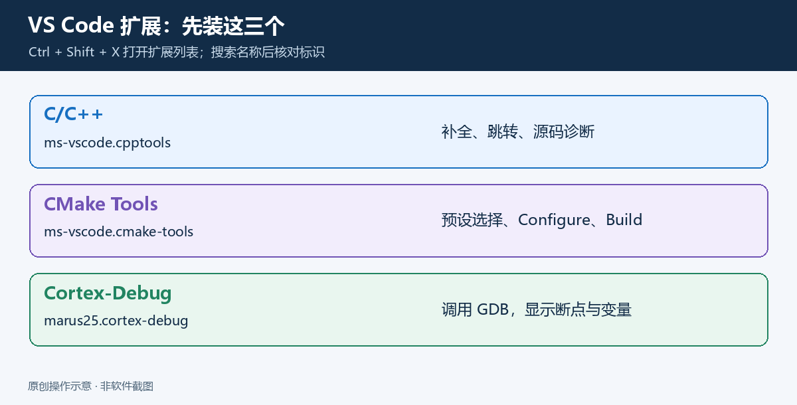

**验收：**扩展列表显示三个扩展已启用；按 `Ctrl + Shift + P`，能搜到 `CMake: Configure`。Cortex-Debug 要等打开工程、添加 `launch.json` 后再验收。

本文使用 C/C++ 扩展提供智能提示。如果你已有 clangd，可使用它读取编译数据库，但应避免两套扩展同时提供 C/C++ 补全而产生重复提示。

### 3.3 ST 官方 VS Code 扩展是否必须安装

ST 提供 STM32CubeIDE for Visual Studio Code 的官方方案，包含工程管理、构建和调试等扩展。其工具分发和依赖会随版本变化，应跟随该版本的官方入门文档。[ST 官方产品说明](https://www.st.com/content/st_com/en/stm32cubeide.html)、[官方 VS Code 文档](https://dev.st.com/stm32cube-docs/stm32cubeide-vscode/latest/en/)

本文选择手动安装通用组件的路线，便于理解每个程序的职责。完成本文流程只需上面的三个核心扩展。如果选择官方扩展的一键部署方式，请按那套方案管理它下载的工具和调试配置，避免同时套用两套路径。本文的项目源码仍采用标准 CMake 格式。

<a id="cubemx-install"></a>
## 4. 安装 CubeMX 和 STM32 固件包

### 4.1 安装 STM32CubeMX

1. 在 ST 产品页面选择 Windows 版 CubeMX。
2. 解压下载包，运行其中的安装程序。
3. 按安装向导选择目录并完成安装。
4. 启动 CubeMX，在 **Help → About** 中确认版本。

较新的 Windows 安装包通常包含所需的 Java 运行环境。先按该版本安装说明运行；只有安装包明确要求外部 Java，或报错指出缺少 Java 时，才安装它要求的版本。

**验收：**能够进入 CubeMX 主界面，打开 MCU 选择器；后面在 Project Manager 中能选择 CMake。

### 4.2 固件包与编译器是两种东西

`STM32Cube FW_F1` 里面是 **STM32F1 的驱动和基础软件**；GCC 是把这些软件和你的源码编译成固件的程序。安装了固件包后，仍然需要 GCC。

在 CubeMX 主页选择 **INSTALL / REMOVE**，或在菜单中寻找 **Manage embedded software packages**。展开 **STM32Cube MCU Packages → STM32F1**，选择可用版本并安装。不同版本可能把管理器放在 Help 菜单或软件安装管理区。

首次生成工程时，如果缺少对应固件包，CubeMX 也可能提示下载。本教程安装 STM32F1 对应的包即可，不必一次安装所有 STM32 系列。

下载过程中需要联网。离线环境可以先从 ST 官方获取对应包，再通过管理器的 **From Local** 功能安装。CubeMX 版本与固件包版本需要相互兼容。

**验收：**软件包管理器中所选 F1 包显示已安装；生成代码时不再提示缺少 F1 固件包。

CubeMX 的硬件设置保存在 `.ioc` 中，生成代码时从固件包获取对应依赖。[STM32CubeMX 官方产品介绍](https://www.st.com/en/development-tools/stm32cubemx.html)

<a id="toolchain"></a>
## 5. 安装 GCC、CMake、Ninja 和 OpenOCD

### 5.1 Arm GNU Toolchain：真正的交叉编译器

1. 打开 Arm 官方入口，选择所需发布版本。
2. 选择 **Windows 主机 + arm-none-eabi 目标**的工具链。
3. 使用安装包时，记下安装目录；使用 ZIP 时，把完整工具链目录解压到约定位置。
4. 检查 `C:\STM32Tools\arm-gnu\bin` 中是否有 `arm-none-eabi-gcc.exe` 和 `arm-none-eabi-gdb.exe`。
5. 保留同级的库、头文件和 `arm-none-eabi` 等目录。

**验收：**先用绝对路径运行一次，排除 PATH 干扰：

```powershell
& 'C:\STM32Tools\arm-gnu\bin\arm-none-eabi-gcc.exe' --version
& 'C:\STM32Tools\arm-gnu\bin\arm-none-eabi-gdb.exe' --version
```

这里的 `&` 是 PowerShell 的调用运算符，用来执行后面引号中的程序路径。以后路径包含空格时，也使用这种写法。

### 5.2 CMake：生成构建规则

1. 打开 CMake 下载页，选择 Windows x64 安装包或 ZIP。
2. 使用安装包时，勾选把 CMake 加入 PATH 的选项；使用 ZIP 时，保留完整解压目录。
3. 本文约定程序为 `C:\STM32Tools\cmake\bin\cmake.exe`。若实际安装到 `C:\Program Files\CMake`，后面 PATH 加入实际的 `bin` 目录即可。

**验收：**

```powershell
& 'C:\STM32Tools\cmake\bin\cmake.exe' --version
```

CMake 的最低版本由工程决定。打开生成的根 `CMakeLists.txt`，第一行附近的 `cmake_minimum_required(VERSION ...)` 就是要求。[CMake 官方下载与平台包](https://cmake.org/download/)

### 5.3 Ninja：执行构建规则

1. 打开 Ninja 官方 Releases。
2. 在 Assets 中选择适合本机的 Windows 包；x64 电脑通常使用 `ninja-win.zip`，如果发布页另列架构，请匹配架构。
3. 解压得到 `ninja.exe`，保存到 `C:\STM32Tools\ninja`。

**验收：**

```powershell
& 'C:\STM32Tools\ninja\ninja.exe' --version
```

注意：Ninja 的 PATH 项是 `C:\STM32Tools\ninja`，这里没有再多一层 `bin`。[Ninja 官方发布页](https://github.com/ninja-build/ninja/releases)

### 5.4 OpenOCD：烧录和调试服务器

OpenOCD 上游提供源代码和文档；为了在 Windows 上直接使用，本文选用维护者发布的 xPack 预编译包。

1. 打开 xPack OpenOCD Releases，选择对应发布版本。
2. 找到 Windows x64 的 ZIP，例如本教程配置对应的 `xpack-openocd-0.12.0-7-win32-x64.zip`。
3. 完整解压，找到同时包含 `bin` 和 `openocd` 的那层目录。
4. 将这层目录整理为 `C:\STM32Tools\openocd`，保留 `openocd/scripts`。

**验收：**

```powershell
& 'C:\STM32Tools\openocd\bin\openocd.exe' --version
Test-Path 'C:\STM32Tools\openocd\openocd\scripts\interface\stlink.cfg'
Test-Path 'C:\STM32Tools\openocd\openocd\scripts\target\stm32f1x.cfg'
```

应显示版本，并且两个 `Test-Path` 都返回 `True`。程序版本命令不需要连接开发板。[xPack OpenOCD 发布页](https://github.com/xpack-dev-tools/openocd-xpack/releases/tag/v0.12.0-7)

### 5.5 安装 ST-LINK USB 驱动

从 STSW-LINK009 下载并解压驱动包，运行匹配 Windows 架构的安装程序。安装包中文件名可能随版本变化，请以包内说明为准。接入开发板后，在 Windows 设备管理器中检查 ST-LINK 调试接口是否正常枚举、是否有黄色感叹号。[ST-LINK 驱动说明](https://www.st.com/en/development-tools/stsw-link009.html)

出现虚拟串口或 U 盘盘符，只证明相应 USB 接口已枚举；调试接口也需要正常。后面用 OpenOCD 的连接测试判断软件是否真正能访问目标芯片。

### 5.6 可选：安装 STM32CubeProgrammer

它是 ST 的独立烧录工具，可以用于检查 ST-LINK、通过 GUI 连接目标、烧录 ELF/HEX/BIN，以及按工具提示升级探针固件。本文日常烧录和调试使用 OpenOCD，因此 CubeProgrammer 可作为排查连接问题的辅助工具。

进行 OpenOCD 或 VS Code 调试前，先断开 CubeProgrammer 与探针的连接。多个软件同时使用一个探针可能发生占用冲突。[STM32CubeProgrammer 官方介绍](https://www.st.com/en/development-tools/stm32cubeprog.html)

### 5.7 可选：用 STM32CubeCLT 集中安装命令行工具

STM32CubeCLT 是 ST 的命令行工具集合，某些版本包含 GNU 工具链、CMake、Ninja、ST-LINK GDB Server、CubeProgrammer 等组件。以具体发布版本的文件清单为准。[STM32CubeCLT 官方产品页](https://www.st.com/en/development-tools/stm32cubeclt.html)

如果你已经安装 CubeCLT，可以使用里面相应工具的完整路径；不必为了目录名字与本文一致再安装一遍。本文使用 `servertype: openocd`，因此仍需提供 OpenOCD。改用 ST-LINK GDB Server 时，需要对应的 Cortex-Debug `stlink` 配置，以及服务器和 CubeProgrammer 的路径；不能只把服务器程序名换一下。

<a id="path"></a>
## 6. 配置 PATH：让终端和 VS Code 找到程序

### 6.1 PATH 是什么

执行 `cmake --version` 时，Windows 需要知道 `cmake.exe` 在哪里。PATH 就是供系统依次查找可执行程序的目录列表。

例如，把 `C:\STM32Tools\arm-gnu\bin` 加入 PATH 后，输入 `arm-none-eabi-gcc` 就相当于调用那个目录中的 GCC。

**PATH 中添加目录，不添加 EXE 文件本身，也不添加整段命令。**

### 6.2 按界面设置用户 PATH

1. 在 Windows 开始菜单搜索“编辑账户的环境变量”，打开对应界面；也可以进入系统属性的“环境变量”。
2. 在上半部分的**用户变量**中找到 `Path`，点击“编辑”。
3. 点击“新建”，逐行添加实际存在的目录：

```text
C:\STM32Tools\arm-gnu\bin
C:\STM32Tools\cmake\bin
C:\STM32Tools\ninja
C:\STM32Tools\openocd\bin
```

4. 一路点击“确定”保存。
5. 完全退出 VS Code，再重新启动；旧终端也关闭后重开。

**不要用这些四行覆盖原有 PATH。**已有目录要保留。如果安装程序已经加入某个目录，无需重复添加。

CubeMX 和 CubeProgrammer 的图形界面无需加入 PATH。本教程也不需要全局配置 `JAVA_HOME`。

### 6.3 在新的 PowerShell 中逐个检查

```powershell
arm-none-eabi-gcc --version
arm-none-eabi-g++ --version
arm-none-eabi-gdb --version
arm-none-eabi-objcopy --version
cmake --version
ninja --version
openocd --version
```

每条命令都应显示对应软件的信息。随后检查**实际调用位置**：

```powershell
Get-Command arm-none-eabi-gcc, arm-none-eabi-gdb, cmake, ninja, openocd |
    Select-Object Name, Source
```

如果装过多套工具，检查所有匹配项：

```powershell
where.exe arm-none-eabi-gcc
where.exe cmake
where.exe openocd
```

这里写 `where.exe`，避免 PowerShell 中的 `where` 别名造成混淆。列表前面的版本通常会优先被找到。确保编译、GDB 和 VS Code 使用你计划使用的工具版本。

**本节验收：**在独立 PowerShell 和 VS Code 的新终端中，上述程序均能运行，而且路径符合预期。这个阶段无需开发板。

<a id="new-project"></a>
## 7. 用 CubeMX 创建第一个 STM32 工程

### 7.1 从 MCU 选择器开始

1. 打开 CubeMX，在主页选择 **ACCESS TO MCU SELECTOR**。
2. 在 **Commercial Part Number** 或型号搜索框输入 `STM32F103C8T6`。
3. 选择对应芯片并点击 **Start Project**。

本文按 MCU 建工程，便于手动配置最小功能。选择开发板的 Board Selector 也能建立工程，但可能自动启用更多外设和时钟配置；请仍按后面的项目核对。

**验收：**进入 **Pinout & Configuration** 页面，所选型号为 STM32F103C8T6、LQFP48 封装。芯片图中可能显示 `STM32F103C8Tx`，其中 `x` 表示界面的型号写法；工程仍对应 C8 器件。

### 7.2 保留 SWD 调试接口

在左侧 **System Core → SYS** 中，将 **Debug** 设为 **Serial Wire**。默认的 **No Debug** 会使生成代码关闭调试接口，必须在生成前改好。

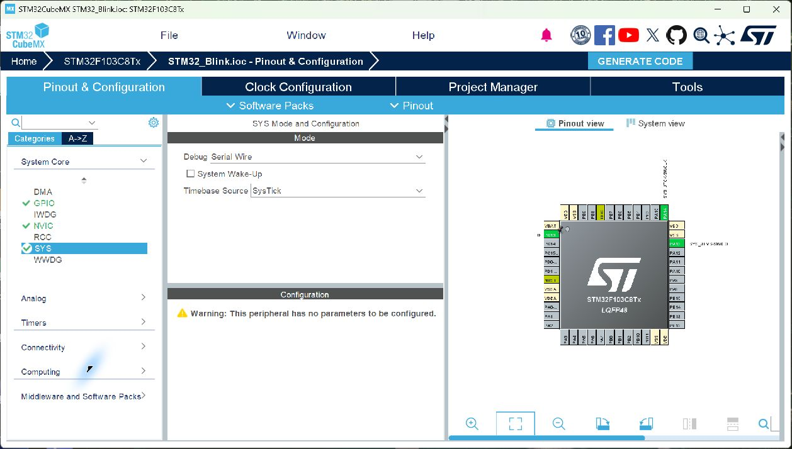

截图下方的 “This peripheral has no parameters to be configured” 表示 SYS 没有其他参数页；上方 Debug 已选择 Serial Wire 即可。

芯片图上的 PA13 对应 SWDIO，PA14 对应 SWCLK。以后配置其他外设时，也要保留这两个引脚，除非你已经明确改用其他下载方式。

### 7.3 配置 LED 引脚 PC13

1. 在芯片图上找到 **PC13**；CubeMX 可能显示为 **PC13-TAMPER-RTC**。点击它，选择 **GPIO_Output**。
2. 在 **System Core → GPIO** 中找到 PC13，核对下面的配置。
3. 将 **User Label** 设置成 `LED`，便于生成易懂的宏名称。

| 项目 | 选择值 | 原因 |
|---|---|---|
| GPIO mode | Output Push Pull | 推挽输出，直接控制 LED 电平 |
| Pull-up / Pull-down | No pull-up and no pull-down | 此例不需要内部上拉或下拉 |
| Maximum output speed | Low，F1 对应 2 MHz | 这是引脚输出速度等级，PC13 应使用低速配置 |
| GPIO output level | High | 对本文的低电平点亮 LED，先让它熄灭 |
| User Label | `LED` | 生成 `LED_Pin` 和 `LED_GPIO_Port` |

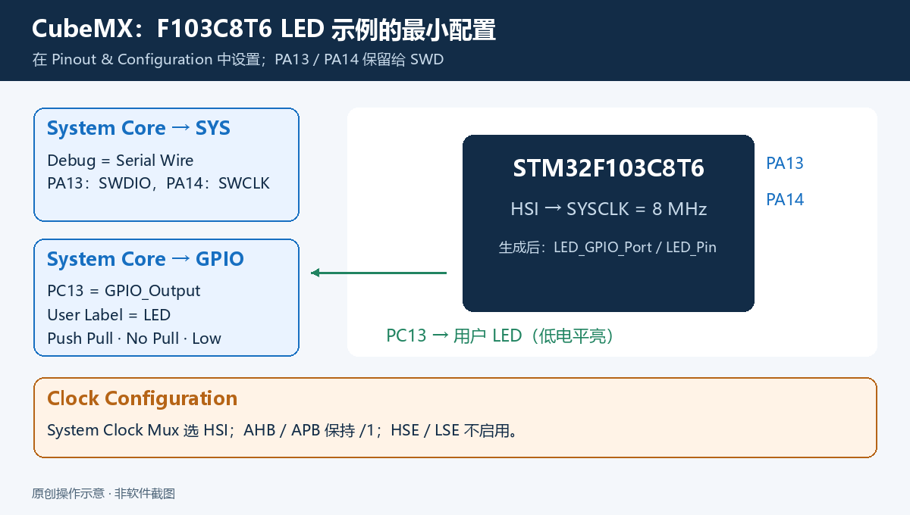

下面是本教程 F103C8T6 工程的真实引脚页面。PC13 为 `LED` 输出，PA13/PA14 用于 SWD。

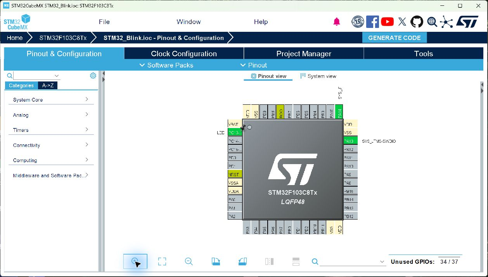

GPIO 页面应能看到 PC13 的 **High、Output Push Pull、No pull、Low、LED** 五项设置。


PC13/PC14/PC15 有专门的驱动限制：输出速度不超过 2 MHz，驱动电流能力有限，不能将 PC13 当作大电流供电输出。本例使用带限流电阻的低电平点亮板载 LED；接外部负载时按数据手册设计驱动电路。[ST 数据手册的引脚限制](https://www.st.com/resource/en/datasheet/stm32f103c8.pdf)

**验收：**PC13 被设为 GPIO 输出，PA13/PA14 保持调试功能。生成代码后，`main.h` 中应有 `LED_Pin` 与 `LED_GPIO_Port` 的定义。

### 7.4 先使用内部 HSI 8 MHz

进入 **Clock Configuration**：让 **System Clock Mux** 选择 **HSI**，AHB、APB 分频先保持 `/1`。最终 SYSCLK 和 HCLK 都应为 **8 MHz**。在 **System Core → RCC** 中不启用外部 HSE/LSE。

此时使用芯片内部振荡器，无需板上的外部晶振，就能先把 GPIO 示例跑起来。以后确有速度、USB 或通信时钟要求，再按芯片和开发板手册配置 PLL/HSE。

**验收：**时钟树没有未解决的错误，SYSCLK、HCLK、PCLK1、PCLK2 均为 8 MHz。72 MHz 需要额外配置 PLL 和总线分频；先按本节完成 LED 与调试验收，再看 [72 MHz 配置步骤](docs/stm32f103.md#clock-72mhz)。

下面是 CubeMX 6.15.0 中本教程验证工程的真实时钟页面：**System Clock Mux 选 HSI**，右侧 HCLK、PCLK1、PCLK2 都显示 8 MHz。


### 7.5 选择 CMake 工程并命名

进入 **Project Manager → Project**，填写：

| 设置 | 本文填写值 |
|---|---|
| Project Name | `STM32_Blink` |
| Project Location | `C:\STM32Projects`；核对最终工程目录为 `C:\STM32Projects\STM32_Blink` |
| Application Structure | **Advanced**，与本文 `Core/Src`、`Core/Inc` 布局一致；如版本不提供此项，以实际输出为准 |
| Toolchain / IDE | **CMake** |
| Default Compiler / Linker | **GCC**；如果此版本提供这个选择框 |
| Firmware Package | 已安装、与当前 CubeMX 兼容的 F1 包；本次验证使用 FW_F1 V1.8.7 |

不同版本对“根目录/生成到当前目录”的选项有所变化。**最终必须找到包含 `.ioc` 和根 `CMakeLists.txt` 的同一目录。**不要生成成两层 `STM32_Blink/STM32_Blink` 后又打开外层目录。

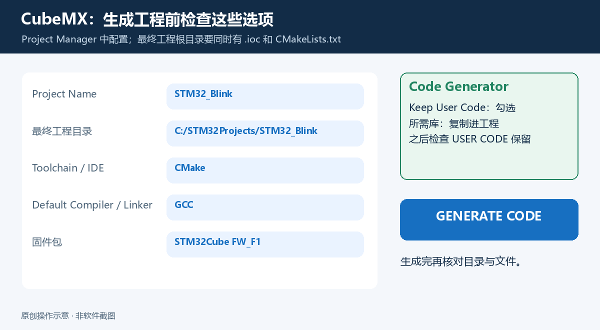

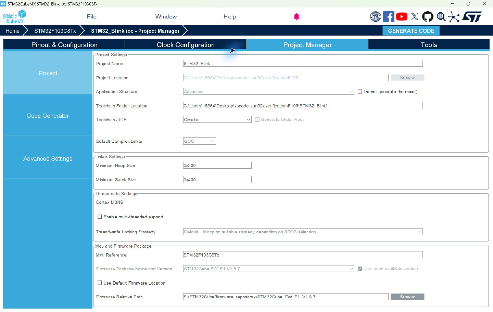

真实截图中的工程保存位置是本机验证目录；你应使用前文约定的 `C:\STM32Projects\STM32_Blink`。目录可以不同，芯片、工具链和固件包必须对应。

在 **Project Manager → Code Generator** 中：

- 勾选 **Keep User Code when re-generating**，保留用户代码区。
- 选择把所需库复制到工程的选项，例如 **Copy only the necessary library files**。如果想完整保留驱动目录，也可复制全部库。
- 对本教程，外设初始化独立生成 `.c/.h` 文件的选项可保持默认；`MX_GPIO_Init()` 所在文件可能因此不同。

复制依赖后，其他人克隆工程不需要你的本机固件包目录。后续用 CubeMX 重新生成仍需要对应固件包。[ST 关于保留 USER CODE 的说明](https://community.st.com/stm32-mcus-products-25/cubemx-after-regenerating-the-project-the-user-code-dissipated-65371)

下面是同一验证工程的真实 Code Generator 页面。截图使用 **Copy all used libraries**，并勾选 **Keep User Code when re-generating**；选择仅复制必需库也适用于本教程。

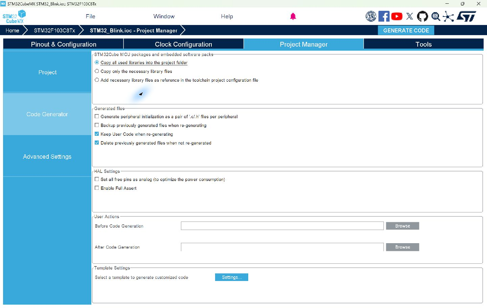

### 7.6 点击 GENERATE CODE

保存 `.ioc`，点击右上角 **GENERATE CODE**。如提示缺少固件包，安装所选版本后再生成。

生成结束后，点击 **Open Folder** 查看文件。工程结构通常类似：

```text
STM32_Blink/
├─ Core/
│  ├─ Inc/main.h
│  └─ Src/main.c
├─ Drivers/
│  ├─ CMSIS/
│  └─ STM32F1xx_HAL_Driver/
├─ cmake/
│  ├─ gcc-arm-none-eabi.cmake
│  └─ stm32cubemx/CMakeLists.txt
├─ startup_stm32f103xb.s
├─ STM32F103XX_FLASH.ld
├─ STM32_Blink.ioc
├─ CMakeLists.txt
└─ CMakePresets.json
```

生成器版本可能改变启动文件、链接脚本的位置或名称，使用实际输出。本文后面依赖的工具链文件路径是 `cmake/gcc-arm-none-eabi.cmake`；如果你生成的名称不同，修改预设中的这一项。

有的项目结构选项会直接生成根目录 `Src/` 和 `Inc/`，而不带 `Core/`。此时把本文的 `Core/Src/main.c`、`Core/Inc/main.h` 对应到实际位置即可，CMake 生成的源码列表已经按该结构组织。

**本节验收：**根目录有 `.ioc` 和 `CMakeLists.txt`，`Core/Src/main.c` 存在，工具链文件存在，HAL/CMSIS 已复制到工程。

<a id="build"></a>
## 8. 在 VS Code 中打开、配置并编译工程

### 8.1 打开正确的工程根目录

在 VS Code 选择 **File → Open Folder**，打开 `C:\STM32Projects\STM32_Blink`。也可以执行：

```powershell
Set-Location 'C:\STM32Projects\STM32_Blink'
code .
```

左侧资源管理器最外层应是 `STM32_Blink`，根目录能直接看到 `CMakeLists.txt`。如果询问工作区信任，只对自己生成或确认可信的工程启用完整功能。

打开 **Terminal → New Terminal**，确认终端位于这个目录。后面的工程命令均在这里执行。

### 8.2 使用本教程的构建预设

保留 CubeMX 生成的 `CMakePresets.json`。新建 `CMakeUserPresets.json`，复制 [预设模板](templates/CMakeUserPresets.json) 的内容：

```json
{
  "version": 3,
  "configurePresets": [
    {
      "name": "tutorial-debug",
      "displayName": "STM32 tutorial / Debug",
      "generator": "Ninja",
      "binaryDir": "${sourceDir}/build/Debug",
      "toolchainFile": "${sourceDir}/cmake/gcc-arm-none-eabi.cmake",
      "cacheVariables": {
        "CMAKE_BUILD_TYPE": "Debug",
        "CMAKE_EXPORT_COMPILE_COMMANDS": true
      }
    }
  ],
  "buildPresets": [
    {
      "name": "tutorial-debug",
      "configurePreset": "tutorial-debug"
    }
  ]
}
```

这里特意创建一个名字固定的预设，后面的命令和任务都使用 `tutorial-debug`，避免不同 CubeMX 版本的预设名称和大小写差异。

| 配置项 | 为什么需要它 |
|---|---|
| `generator: Ninja` | 指定由 Ninja 执行构建 |
| `binaryDir` | 所有构建产物放进 `build/Debug`，源码目录更清楚 |
| `toolchainFile` | 告诉 CMake 使用 CubeMX 提供的 Arm 交叉编译配置 |
| `CMAKE_BUILD_TYPE: Debug` | 使用生成工程的 Debug 编译选项；断点调试需要调试符号 |
| `CMAKE_EXPORT_COMPILE_COMMANDS` | 导出每个源文件的编译参数 |
| `buildPresets` | 让 `cmake --build --preset tutorial-debug` 找到对应构建目录 |

`CMakeUserPresets.json` 适合本机设置，通常不提交到工程仓库；团队共享预设可以放进受版本管理的独立预设文件，或统一维护根预设。注意先确认 CubeMX 的文件覆盖策略。[CMake 预设官方说明](https://cmake.org/cmake/help/latest/manual/cmake-presets.7.html)

### 8.3 先在终端完成一次构建

执行：

```powershell
cmake --list-presets
cmake --preset tutorial-debug
cmake --build --preset tutorial-debug --parallel
```

三条命令分别做什么：

1. `--list-presets`：查看能否找到刚创建的预设。
2. `--preset tutorial-debug`：**配置和生成构建系统**，检查编译器，产生 `build.ninja`。
3. `--build ...`：调用 Ninja 执行编译和链接，产生固件。

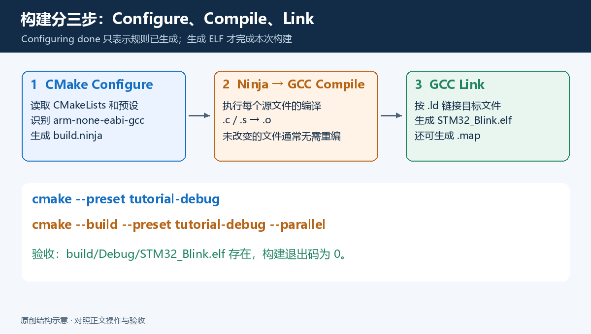

日志应能看到 Arm GCC 的识别信息，以及类似 `Building C object`、`Building ASM object`、`Linking C executable STM32_Blink.elf` 的构建动作。文字和次数随版本与工程内容变化。

检查固件：

```powershell
Test-Path '.\build\Debug\STM32_Blink.elf'
arm-none-eabi-size '.\build\Debug\STM32_Blink.elf'
```

`Test-Path` 返回 `True`，`size` 显示 `text/data/bss` 等信息。`text` 主要是代码和只读数据，`data` 是有初值的可写数据，`bss` 是运行时清零的数据区。Flash/RAM 的精确统计还涉及其他段和加载地址，结合 `.map` 与链接脚本判断。

**不要把 `Configuring done` 当作编译成功。**完整编译成功应有 ELF，并且构建命令退出码为 0。若日志里出现 `cl.exe` 或电脑上的普通 GCC，先检查工具链文件与缓存。

首次构建不需要连接开发板。它验证的是工程和编译工具；下一节的烧录才验证硬件连接。

### 8.4 配置 CMake Tools 和代码补全

在工程根目录新建 `.vscode` 文件夹，创建 `settings.json`，内容见 [设置模板](templates/.vscode/settings.json)：

```json
{
  "cmake.useCMakePresets": "always",
  "cmake.configureOnOpen": false,
  "C_Cpp.default.configurationProvider": "ms-vscode.cmake-tools"
}
```

然后按 `Ctrl + Shift + P`，依次执行：

1. **CMake: Select Configure Preset**，选择 `tutorial-debug`。
2. **CMake: Configure**。
3. 如需要用 CMake Tools 的 Build 按钮，执行 **CMake: Select Build Preset**，同样选择 `tutorial-debug`。

命令行构建会生成编译数据库，但要让 CMake Tools 给 C/C++ 扩展提供配置，仍应在 VS Code 中完成一次 **CMake: Configure**。使用预设时，工具链由预设决定，无需再选择桌面编译器 Kit。

**验收：**打开 `main.c`，按住 `Ctrl` 点击 `HAL_Init` 可以跳转；输入 HAL 函数前缀有补全，`main.h` 和 HAL 头文件没有因缺失路径产生的错误红线。

如果编译成功但编辑器报头文件找不到，先排查 IntelliSense 配置。编辑器诊断和 GCC 编译结果是两个不同环节。[Microsoft 关于 configuration provider 的说明](https://code.visualstudio.com/docs/cpp/configure-intellisense)

<a id="blink"></a>
## 9. 添加 LED 闪烁程序

### 9.1 只在 USER CODE 区域内添加

打开 `Core/Src/main.c`。CubeMX 生成的文件中有成对的标记，例如：

```c
/* USER CODE BEGIN PV */
/* USER CODE END PV */
```

把下面的代码放进**已有的对应区域**，不要把生成的整个 `main.c` 替换掉，也不要再套一层相同标记。

在 `USER CODE BEGIN PD` 与 `USER CODE END PD` 之间添加：

```c
#define LED_BLINK_INTERVAL_MS (500U)
```

在 `USER CODE BEGIN PV` 与 `USER CODE END PV` 之间添加：

```c
static volatile uint32_t s_blink_count = 0U;
```

在 `main()` 中、`MX_GPIO_Init()` 之后的 `USER CODE BEGIN 2` 区域添加：

```c
uint32_t last_tick = HAL_GetTick();
```

在主循环内部的 `USER CODE BEGIN 3` 区域添加：

```c
uint32_t now = HAL_GetTick();

if ((uint32_t)(now - last_tick) >= LED_BLINK_INTERVAL_MS)
{
    last_tick = now;
    HAL_GPIO_TogglePin(LED_GPIO_Port, LED_Pin);
    ++s_blink_count;
}
```

**不要额外新增一个 `while (1)`。**上述代码插入生成器已有的主循环。`last_tick` 位于 `main()` 的作用域中，不能声明在会提前结束的独立大括号中。

尤其注意：有些版本把关闭主循环的 `}` 放在 `USER CODE BEGIN 3` 和 `USER CODE END 3` 之间。**保留这个原有的 `}`，把闪烁代码放在它前面。**主循环这一部分应类似下面这样，其他生成代码继续保留：

```c
  /* USER CODE BEGIN 2 */
  uint32_t last_tick = HAL_GetTick();
  /* USER CODE END 2 */

  /* USER CODE BEGIN WHILE */
  while (1)
  {
    /* USER CODE END WHILE */

    /* USER CODE BEGIN 3 */
    uint32_t now = HAL_GetTick();

    if ((uint32_t)(now - last_tick) >= LED_BLINK_INTERVAL_MS)
    {
      last_tick = now;
      HAL_GPIO_TogglePin(LED_GPIO_Port, LED_Pin);
      ++s_blink_count;
    }
  }
  /* USER CODE END 3 */
```

`uint32_t` 一般已由生成的 `main.h` 和 HAL 头文件提供。若你拆成独立文件，自己包含 `<stdint.h>`。

### 9.2 这几行代码为什么能让 LED 闪烁

`HAL_GetTick()` 获取 HAL 的毫秒计数。主循环检查距离上次切换是否达到 500 ms；达到后切换 PC13 电平，并把 `s_blink_count` 加 1。LED 每 500 ms 切换一次，一次亮灭完整周期约为 1 秒。本文 LED 低电平亮、高电平灭；Toggle 每次反转电平，因此无需改变这段代码。

这里使用无符号差值来处理毫秒计数的回绕，并要求主循环持续运行、及时检查。`HAL_GetTick()` 只是读取计数，GPIO 切换直接访问对应寄存器；此例没有用 `HAL_Delay()` 阻塞主循环。

`s_blink_count` 用于后面练习查看变量。`volatile` 让编译器保留对它的可观察读写；它不提供线程同步能力。此例只有主循环更新它，没有 RTOS 或其他中断读写它。

要让毫秒计数推进，CubeMX 生成的 HAL 时基中断需要正常运行。发生 HardFault、长时间关闭中断或停在断点时，LED 的时间行为也会相应变化。

### 9.3 重新编译

```powershell
cmake --build --preset tutorial-debug --parallel
```

**验收：**构建成功，`build/Debug/STM32_Blink.elf` 更新。若 `LED_Pin` 未定义，回到 CubeMX 确认 PC13 的 User Label 是 `LED`，重新生成，然后查看 `main.h`。

<a id="flash"></a>
## 10. 连接开发板并烧录

### 10.1 先检查目标板供电和启动跳线

1. 把 **BOOT0 跳线设为 0**；有 BOOT1 跳线时按原理图设为常规运行位置，常见为 0。
2. 给目标板提供稳定供电，确认芯片电源域为 3.3 V。若通过板上 USB/5V 入口供电，必须确认该入口经过板载稳压电路；不要把 5 V 接到 3.3 V 电源脚。
3. 通过支持数据传输的 USB 线把 **外置 ST-LINK** 接到电脑，并在设备管理器确认探针被识别。
4. 按下一节连接探针与目标板。接线前断开供电，核对后再上电。

开发板电源灯亮，只说明板子获得供电；电脑识别 ST-LINK，才说明探针的 USB 数据通路正常。目标板 USB 接口与外置 ST-LINK 的 USB 接口是两个不同入口。

### 10.2 使用外置 ST-LINK 时怎么接线


| 探针信号 | STM32 端 | 作用 |
|---|---|---|
| SWDIO | SWDIO；本例 PA13 | 调试数据 |
| SWCLK | SWCLK；本例 PA14 | 调试时钟 |
| GND | GND | 两侧共地 |
| VTref / Vref / Target VCC | 目标板的 3.3 V 电源域，按探针说明连接 | 给探针提供目标电压参考 |
| NRST | NRST，可选但建议接 | 硬件复位、连接恢复 |

有些探针的 `3.3V` 是电源输出，有些是目标电压参考输入。**看清探针手册与引脚标识后再连接，不能把 VTref 一律当供电输出。**目标板须有稳定供电；已有独立供电时，避免把两个电源输出直接并在一起。

对没有内置下载器的最小系统板，板上 USB 接口是否能下载，取决于实际 USB 硬件和引导程序。接了 USB 线并不自动得到 SWD 调试功能。

### 10.3 创建 OpenOCD 配置

在工程根目录新建 `openocd.cfg`，内容见 [STM32F103C8T6 配置模板](templates/openocd.cfg)：

```tcl
source [find interface/stlink.cfg]
transport select swd
source [find target/stm32f1x.cfg]
adapter speed 1000
```

| 配置行 | 含义 |
|---|---|
| `interface/stlink.cfg` | 使用所安装 OpenOCD 包的 ST-LINK 接口驱动 |
| `transport select swd` | 选择 SWD 协议，匹配本文验证的 DAP 驱动 |
| `target/stm32f1x.cfg` | 使用 STM32F1 系列目标配置，匹配 STM32F103C8T6 |
| `adapter speed 1000` | 调试时钟 1000 kHz，也就是 1 MHz，便于首次连接 |

`interface` 对应**探针**，`target` 对应**芯片系列**。本文的 ST-LINK 使用 `interface/stlink.cfg`，F103C8T6 使用 `target/stm32f1x.cfg`；换探针或芯片后分别核对对应部分。

<a id="openocd-transport"></a>
### 10.4 注意 SWD 与 HLA 配置不能混用

OpenOCD 的 ST-LINK 配置在不同发布包中可能不同：较新的 DAP 驱动使用 `adapter driver st-link` 与 `swd`；一些旧版脚本使用 `adapter driver hla` / `hla_layout stlink` 与 `hla_swd`。

打开你实际安装目录中的 `interface/stlink.cfg` 检查它使用哪种驱动。本文验证的 xPack 0.12.0-7 使用 DAP，因此选择 `swd`。若你的包只有旧 HLA 脚本，应使用与它匹配的 `hla_swd`；如果新包单独提供 `stlink-hla.cfg`，也要同时匹配对应传输名称。[OpenOCD 官方探针驱动说明](https://openocd.org/doc/html/Debug-Adapter-Configuration.html)

看到 `Can't select ... transport` 时先核对这一点，不要随机改 GPIO、链接脚本或芯片型号。

### 10.5 先验证连接，再写 Flash

在工程根目录执行这个连接测试：

```powershell
openocd -f openocd.cfg -c "init; shutdown"
```

它初始化连接并退出，不写入新固件。正常情况下会输出探针信息，并识别 Cortex-M3 目标。具体文本随探针和版本变化。

然后烧录：

```powershell
openocd -f openocd.cfg -c "program {build/Debug/STM32_Blink.elf} verify reset exit"
```

这条命令做四件事：

1. `program`：把 ELF 中可加载的内容写入目标 Flash。
2. `verify`：校验写入的数据。
3. `reset`：复位，让芯片重新启动运行。
4. `exit`：关闭 OpenOCD，释放探针。

这一步会更新开发板上对应区域的固件。确认目标就是你准备运行此示例的板子。[OpenOCD Flash Programming 文档](https://openocd.org/doc/html/Flash-Programming.html)

**本节验收：**日志显示烧录与校验成功，开发板 **PC13 用户 LED** 约每 500 ms 切换亮灭。请区分一直亮的电源指示灯和可控的用户 LED；本例板子上的用户 LED 在 PC13 为低电平时点亮。

### 10.6 找不到脚本时指定搜索目录

如果提示找不到 `interface/stlink.cfg`，先确认没有只复制 EXE。包目录完整时，可以显式传入 `-s`：

```powershell
openocd -s 'C:/STM32Tools/openocd/openocd/scripts' `
    -f openocd.cfg `
    -c "program {build/Debug/STM32_Blink.elf} verify reset exit"
```

这里的反引号是 PowerShell 换行符，必须位于行末，后面不能有空格。也可以把命令写成一行。将 `-s` 的路径改为本机真正的 scripts 目录。

<a id="tasks"></a>
## 11. 在 VS Code 中一键编译和烧录

### 11.1 复制配套配置文件

本仓库的 `templates/` 提供可直接复制的配置。目标结构如下：

```text
STM32_Blink/
├─ .vscode/
│  ├─ extensions.json
│  ├─ settings.json
│  ├─ tasks.json
│  └─ launch.json
├─ CMakeUserPresets.json
├─ openocd.cfg
├─ CMakeLists.txt        ← CubeMX 生成，保留
└─ ...
```

具体对应关系：

| 本教程文件 | 复制到你的工程 | 控制的行为 |
|---|---|---|
| [extensions.json](templates/.vscode/extensions.json) | `.vscode/extensions.json` | 推荐安装扩展；不会自行安装 |
| [settings.json](templates/.vscode/settings.json) | `.vscode/settings.json` | CMake 与代码补全 |
| [tasks.json](templates/.vscode/tasks.json) | `.vscode/tasks.json` | 编译与烧录动作 |
| [launch.json](templates/.vscode/launch.json) | `.vscode/launch.json` | 调试启动动作 |
| [CMakeUserPresets.json](templates/CMakeUserPresets.json) | 根目录 `CMakeUserPresets.json` | 固定的 Debug 构建预设 |
| [openocd.cfg](templates/openocd.cfg) | 根目录 `openocd.cfg` | F103C8T6 + ST-LINK 的连接配置 |
| [project.gitignore](templates/project.gitignore) | 根目录 `.gitignore`，与已有规则合并 | 忽略构建产物和本机预设 |

> 本仓库是教程与配置模板。读者的 STM32 工程需要在第 7 节用 CubeMX 生成；不要直接把本教程根目录当作可编译固件工程。

### 11.2 `tasks.json` 如何串起动作

模板中有三个任务：

| 任务 | 实际执行 | 依赖关系 |
|---|---|---|
| `STM32: Configure` | `cmake --preset tutorial-debug` | 无 |
| `STM32: Build` | `cmake --build --preset tutorial-debug --parallel` | 先 Configure |
| `STM32: Flash` | OpenOCD 的 `program ... verify reset exit` | 先 Build |

Configure 每次执行通常很快；Ninja 仍按文件依赖进行增量构建。先构建再烧录，能减少“修改了源码，但写入的还是上一次固件”的问题。

任务使用 `type: process`，参数作为数组传给程序；`cwd` 指向工程根目录，`$gcc` problem matcher 把 GCC 的诊断显示到 Problems 面板。[VS Code Tasks 文档](https://code.visualstudio.com/docs/editor/tasks)

**使用方式：**

- 按 `Ctrl + Shift + B`：运行默认任务 `STM32: Build`。
- 按 `Ctrl + Shift + P`，执行 **Tasks: Run Task**，选择 `STM32: Flash`：构建并烧录。
- 点击终端下拉列表：查看对应任务日志。

### 11.3 工程改名时需要改哪里

模板中的固件文件名写成了 `STM32_Blink.elf`。如果你的工程叫 `MotorControl`，应以实际构建的 ELF 名称为准，在这两处修改：

1. `tasks.json` 中 Flash 任务的固件路径。
2. `launch.json` 中的 `executable`。

如果还改了构建目录，同步更新这两处和预设的 `binaryDir`。`${workspaceFolder}` 由 VS Code 替换成当前工程根目录，不需要写成本机用户名路径。

**本节验收：**快捷键构建成功；选择 Flash 任务后日志校验成功，LED 正常闪烁。错误时先看任务日志，确认它调用的程序、目录和 ELF。

<a id="debug"></a>
## 12. 配置并完成断点调试

### 12.1 调试链路与烧录链路有什么区别

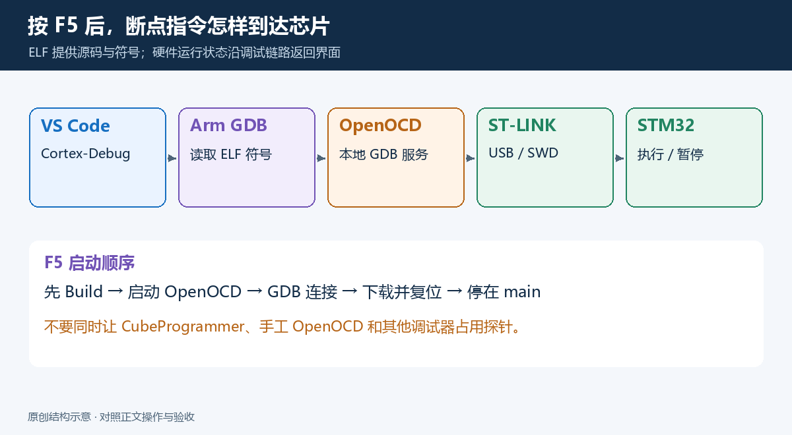

Cortex-Debug 把 VS Code 的调试操作翻译成 GDB 动作，GDB 通过本地 GDB 协议与 OpenOCD 通信，OpenOCD 再控制 ST-LINK 和芯片。OpenOCD 通常监听本地 3333 端口；Cortex-Debug 可能为调试会话自动选择其他端口。

调试器还会读取 ELF 里的源码位置、函数名和变量信息。BIN 本身缺少这些调试符号，因此 `launch.json` 的 `executable` 指向 ELF。

### 12.2 理解 `launch.json`

复制 [调试模板](templates/.vscode/launch.json)。关键配置如下：

```json
{
  "version": "0.2.0",
  "configurations": [
    {
      "name": "STM32: Debug (OpenOCD + ST-LINK)",
      "cwd": "${workspaceFolder}",
      "type": "cortex-debug",
      "request": "launch",
      "servertype": "openocd",
      "executable": "${workspaceFolder}/build/Debug/STM32_Blink.elf",
      "runToEntryPoint": "main",
      "preLaunchTask": "STM32: Build",
      "serverpath": "openocd",
      "gdbPath": "arm-none-eabi-gdb",
      "configFiles": ["${workspaceFolder}/openocd.cfg"]
    }
  ]
}
```

| 字段 | 作用 |
|---|---|
| `type` | 选择 Cortex-Debug 扩展 |
| `request: launch` | 启动调试，通常会下载程序、复位并运行到指定入口 |
| `servertype` | 让扩展启动 OpenOCD 作为 GDB 服务器 |
| `executable` | 用于加载固件与符号的 ELF |
| `runToEntryPoint: main` | 启动后先停在 `main()` |
| `preLaunchTask` | 调试前先构建；名字必须与 `tasks.json` 完全一致 |
| `serverpath` | OpenOCD 可执行程序名称或完整路径 |
| `gdbPath` | Arm GDB 的名称或完整路径 |
| `configFiles` | 告诉 OpenOCD 使用哪个探针和目标配置 |

此模板让 Cortex-Debug 自己启动并结束 OpenOCD。启动前关闭你手工运行且尚未退出的 OpenOCD，断开其他调试软件对 ST-LINK 的连接。[Cortex-Debug 配置属性说明](https://github.com/Marus/cortex-debug/blob/master/debug_attributes.md)

PATH 正常时，模板中的程序名称可以直接使用。如果 VS Code 扩展进程仍找不到程序，完全退出后重开；也可以改成完整路径：

```json
"serverpath": "C:/STM32Tools/openocd/bin/openocd.exe",
"gdbPath": "C:/STM32Tools/arm-gnu/bin/arm-none-eabi-gdb.exe"
```

仅在查找脚本失败时，在调试配置对象中添加：

```json
"searchDir": ["C:/STM32Tools/openocd/openocd/scripts"]
```

这些是字段片段，请添加到同一个配置对象中，按 JSON 规则补逗号。JSON 路径建议使用 `/`；如果使用 `\`，要写成 `\\`。不要把完整路径指向 `bin` 文件夹，`serverpath` 和 `gdbPath` 需要具体可执行程序。

### 12.3 第一次按 F5

1. 连接开发板，确保第 10 节的连接和烧录已通过。
2. 点击左侧 **Run and Debug**，或按 `Ctrl + Shift + D`。
3. 在顶部下拉框选择 `STM32: Debug (OpenOCD + ST-LINK)`。
4. 按 `F5`。
5. 等待构建、OpenOCD 启动、GDB 连接和程序下载。
6. 源码应出现黄色执行位置，停在 `main()` 附近。

**第一次验收：**能够停到 `main()`。如果一直无法到达，先看 Debug Console 与 GDB Server 输出，确认目标识别、下载和复位是否成功，再检查时钟/启动代码。

### 12.4 设置断点并查看变量

在 `HAL_GPIO_TogglePin(LED_GPIO_Port, LED_Pin);` 这一行左侧点击，出现红点。按 `F5` 继续运行，约 500 ms 后应停在这里。

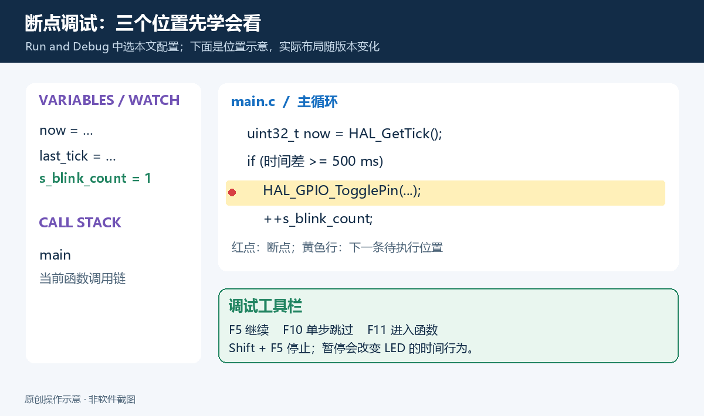

暂停后可以：

- 在 **Variables** 查看 `now`、`last_tick` 等局部变量。
- 在 **Watch** 添加 `s_blink_count`，观察累计切换次数。若静态变量解析有问题，可尝试 GDB 表达式 `'main.c'::s_blink_count`。
- 查看 **Call Stack**，了解当前执行的函数链。
- 在 Debug Console 中按扩展支持的 GDB 命令格式查看表达式，例如 `p s_blink_count`。

调试时的变量窗口通常在芯片暂停后刷新；不要把普通 Watch 当作无需暂停的实时示波器。

| 快捷键 | 动作 | 初次练习怎么用 |
|---|---|---|
| `F5` | Continue | 继续运行，直到下一个断点 |
| `F10` | Step Over | 执行当前行，不进入被调用函数 |
| `F11` | Step Into | 进入函数，例如进入 HAL 的实现 |
| `Shift + F11` | Step Out | 从当前函数返回上层 |
| `Shift + F5` | Stop | 结束调试会话，释放连接 |

在切换 GPIO 那一行按 `F10`，应该能看到 PC13 用户 LED 的亮灭变化；执行计数增加的语句后，Watch 中的计数也会变化。断点暂停会影响程序运行时间，观察闪烁频率时应让程序继续运行。

### 12.5 可选：查看外设寄存器

外设查看器通常需要对应芯片的 SVD 描述文件和相关扩展。选择与 STM32F103C8T6 匹配的文件，再按当前 Cortex-Debug/外设查看扩展的说明配置 `svdFile`。

SVD 用于告诉界面寄存器叫什么、位域如何解释，不是编译或烧录的必要条件。先完成断点和变量观察，再配置外设查看，便于定位问题。

**本节最终验收：**能停在 `main()`，主循环断点命中，能单步切换 LED 并看到 `s_blink_count` 增加。到这里才算完整跑通“编辑—编译—烧录—调试”。

<a id="daily"></a>
## 13. 日常开发：改代码、改硬件配置、换芯片

### 13.1 只修改应用代码

保存源码 → `Ctrl + Shift + B` 编译 → Flash 任务烧录，或 `F5` 调试。运行中的芯片不会因保存源码自动更新，必须重新构建和下载。

### 13.2 修改 GPIO、时钟或外设

打开 `.ioc` → 在 CubeMX 修改 → Generate Code → 检查文件变化 → 重新 Configure → Build → 下载。

生成前提交一次 Git 或做好备份；生成后查看差异。用户代码放在生成器已有的 USER CODE 区，独立业务代码放在自己维护的文件中。生成器维护的 HAL 和 CMake 子目录里，不要随意插入期望长期保留的业务代码。

### 13.3 增加一个自己的源文件

假设你新增 `App/app.c` 和 `App/app.h`，要让编译器真正编译它，需要把源文件和头文件目录加入构建。找到根 `CMakeLists.txt` 中允许用户维护的相应位置，在 target 已定义后添加：

```cmake
target_sources(${CMAKE_PROJECT_NAME} PRIVATE
    App/app.c
)

target_include_directories(${CMAKE_PROJECT_NAME} PRIVATE
    App
)
```

这段写法适用于生成工程使用 `${CMAKE_PROJECT_NAME}` 作为 target 名称的情况；先查看实际 `add_executable(...)`，如果名称不同，换成那个 target 名称。保留 CubeMX 生成的 `add_subdirectory(cmake/stm32cubemx)` 等配置。[CMake target_sources 文档](https://cmake.org/cmake/help/latest/command/target_sources.html)

**仅把文件放进 VS Code 资源管理器，不等于它加入了构建。**生成器管理的 `cmake/stm32cubemx/CMakeLists.txt` 可能被重新生成；优先维护根 CMake 文件中用户可管理的区域，并用 Git 复查覆盖行为。

### 13.4 需要 BIN/HEX 时手动转换

在已有 ELF 后执行：

```powershell
arm-none-eabi-objcopy -O binary `
    '.\build\Debug\STM32_Blink.elf' '.\build\Debug\STM32_Blink.bin'
arm-none-eabi-objcopy -O ihex `
    '.\build\Debug\STM32_Blink.elf' '.\build\Debug\STM32_Blink.hex'
```

下载 BIN 时还需要告诉下载工具起始地址；普通无 Bootloader 的 STM32 内部 Flash 工程常从 `0x08000000` 开始，但最终应看工程链接脚本。HEX/ELF 自身含地址信息。[GNU objcopy 手册](https://sourceware.org/binutils/docs/binutils/objcopy.html)

### 13.5 换成另一颗 STM32

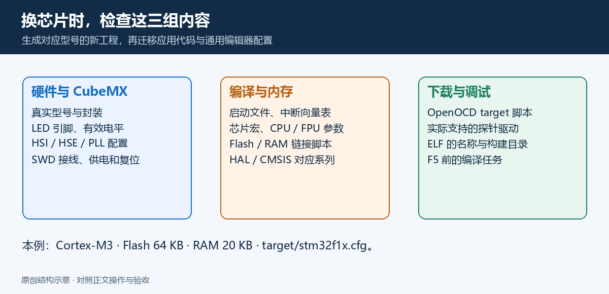

换芯片后至少核对以下项目：

| 项目 | 从哪里得到正确值 |
|---|---|
| 芯片型号与封装 | 芯片丝印、板子原理图、CubeMX |
| LED 引脚和有效电平 | 板子原理图 |
| HSI/HSE/PLL 与电源配置 | 芯片手册、实际晶振/时钟源 |
| 启动文件、芯片宏、CPU/FPU 参数 | 由正确芯片的 CubeMX 工程生成 |
| Flash 与 RAM 大小/地址 | 数据手册、链接脚本 |
| OpenOCD target 脚本 | 所安装 OpenOCD 对该系列的支持 |
| 调试接口与接线 | 芯片和探针手册 |
| ELF 名称和构建目录 | 实际构建输出 |

初学者直接新建目标芯片的 CubeMX 工程，再迁移自己的应用代码和通用 VS Code 配置更容易检查。对于多核、TrustZone、外部 Flash 和 Bootloader 工程，需要额外处理对应的目标、内存和启动配置，本文单核内部 Flash 示例不覆盖这些情况。

<a id="troubleshooting"></a>
## 14. 常见问题：先找出是哪一层出错

先按这个顺序判断：

**程序能否找到 → CMake 能否 Configure → GCC 能否生成 ELF → OpenOCD 能否连接 → 烧录能否校验 → 程序能否运行 → 断点能否命中。**

前一步未通过，就先处理前一步。比如 GCC 没生成 ELF，修改 ST-LINK 接线不会解决编译错误。

| 看到的现象 | 常见原因 | 优先检查 |
|---|---|---|
| “不是内部或外部命令” / “无法将…识别为 cmdlet” | PATH 不对，或旧终端未更新 | 新终端中 `Get-Command`；检查加入的是程序所在目录 |
| 独立终端能运行，VS Code 找不到 | VS Code 继承了旧 PATH | 完全退出 VS Code 后重开；必要时给扩展完整路径 |
| `Could not read presets` / 找不到 `tutorial-debug` | 文件不在根目录、JSON 语法错误、名称大小写不同 | `Get-Location`、预设文件名、`cmake --list-presets` |
| `Could not find toolchain file` | 预设中的工具链路径与生成文件不同 | `Test-Path .\cmake\gcc-arm-none-eabi.cmake` |
| CMake 找不到 Ninja | 未安装或 PATH 指到了错误层级 | `ninja --version`；Ninja EXE 所在目录 |
| CMake 使用 `cl.exe` 或普通 GCC | 没指定交叉工具链，或旧缓存 | 检查预设/工具链；建立全新的构建目录 |
| 更换生成器或编译器后 Configure 报缓存冲突 | 同一个构建目录留下旧配置 | 使用新构建目录，或清理确认可重建的缓存 |
| CMake 提示最低版本不足 | CMake 版本低于生成工程要求 | 根 `cmake_minimum_required`，实际 `cmake --version` |
| 工具链缺 G++ / objcopy / 库 | 只复制了部分程序，或选错安装包 | 完整解压 Windows `arm-none-eabi` 工具链 |
| 编辑器有红线，编译却成功 | IntelliSense 没获得编译配置 | CMake Tools 选择正确预设并 Configure；检查 provider |
| `LED_Pin` / `LED_GPIO_Port` 未定义 | CubeMX 没设置标签，或未重新生成 | PC13 的 User Label 与 `main.h` |
| `undefined reference to ...` | 函数实现未加入 target 或名称不匹配 | `target_sources`、声明/定义、源码是否参与编译 |
| `region FLASH overflowed` / `RAM overflowed` | 程序超出芯片内存，或链接脚本选错 | 真实芯片容量、`.map`、链接脚本；不要随意扩大物理容量 |
| 找不到 `interface/stlink.cfg` | OpenOCD 包不完整，或 scripts 位置不同 | 真实目录；用 `-s` / `searchDir` |
| `Can't select ... transport` | DAP/HLA 驱动与传输名称不匹配 | 查看所安装接口脚本；匹配 `swd` 或 `hla_swd` |
| `open failed` / 找不到 ST-LINK | USB 数据线/驱动/探针占用问题 | 设备管理器，换数据线，断开其他调试软件 |
| 能看到 ST-LINK，但找不到 STM32 | 目标未供电，SWD 接线/跳线错误 | 目标电压、共地、SWDIO/SWCLK、NRST、调试引脚 |
| 连接超时或不稳定 | 接线太长、SWD 时钟高、芯片状态异常 | 先降为 `adapter speed 100`，检查 NRST 与供电 |
| 旧程序改用了 SWD 引脚或进入低功耗 | 普通连接窗口很短 | 使用支持的 connect-under-reset 方法，接 NRST；先用 CubeProgrammer 验证 |
| 烧录成功但 PC13 LED 不闪 | 看错 LED、启动跳线/引脚/时钟错误 | BOOT0 = 0、PC13、USER CODE 位置、Error_Handler/HardFault、HAL 时基 |
| F5 提示没有 cortex-debug 类型 | Cortex-Debug 未安装或未启用 | 扩展状态，重新加载 VS Code |
| F5 找不到 ELF | 名称/目录错误，构建没成功 | `executable` 与实际产物；preLaunchTask 日志 |
| GDB 服务端口占用 | 手工 OpenOCD 未退出，或另一调试会话存在 | 关闭已知旧会话，释放探针和端口 |
| 变量 `<optimized out>` / 单步跳行 | 优化影响变量与源码对应关系 | Debug 构建；检查 `compile_commands.json` 中 `-g` 与优化选项 |
| 断点灰色或不命中 | 运行固件与 ELF 不一致、源码版本不同、断点行无机器指令 | 重新构建并 launch 下载，选可执行语句行 |
| 重新生成后自己的代码丢失 | 放在 USER CODE 外，或编辑了生成器维护的文件 | 从 Git 恢复，检查 Keep User Code；移到用户维护的位置 |

### 14.1 不修改旧目录，用新的构建目录检查缓存问题

如果旧缓存已经混入了桌面编译器或另一个生成器，可以先使用新的目录确认问题：

```powershell
cmake -S . -B build/DebugFresh -G Ninja `
    -DCMAKE_TOOLCHAIN_FILE=cmake/gcc-arm-none-eabi.cmake `
    -DCMAKE_BUILD_TYPE=Debug `
    -DCMAKE_EXPORT_COMPILE_COMMANDS=ON
cmake --build build/DebugFresh --parallel
```

新 ELF 在 `build/DebugFresh` 中。如果以后正式改用这个目录，要同步更新构建预设、Flash 任务和调试路径。排查阶段只比较构建结果即可。

### 14.2 保留日志，描述具体问题

求助时提供：工具版本、芯片型号、探针型号、执行的完整命令、第一条错误及附近日志。只贴最后一行“build failed”，很难判断是源码、工具链还是连接问题。

<a id="github"></a>
## 15. 整理并上传 GitHub

### 15.1 上传这份教程

本教程的发布文件结构为：

```text
vscode-stm32/
├─ README.md                 # 完整主教程
├─ assets/images/            # 配图，PNG 用于阅读，SVG 是可编辑源图
├─ docs/
│  ├─ stm32f103.md            # 板级检查与可选 72 MHz 时钟
│  ├─ verification.md         # 版本与验证范围
│  └─ image-notes.md          # 配图说明
└─ templates/                # 复制到读者 CubeMX 工程的配置
```

图片使用仓库内的相对路径，上传时要同时保留 `assets/`。在 GitHub 仓库首页，`README.md` 会直接显示图文。不要只上传 README 而漏掉图片和模板。

对于首次上传，可以在 GitHub 创建一个空仓库，在文件上传界面拖入 README、assets、docs、templates 和 `.gitignore`。`.vscode` 是隐藏目录，确认 `templates/.vscode` 内四个 JSON 文件一并上传；用 Git 推送更容易保留完整目录。

如果使用 Git，先在当前教程目录执行本地操作：

```powershell
git init
git add README.md assets docs templates .gitignore
git commit -m "docs: add VS Code STM32 setup guide"
git branch -M main
```

然后使用 GitHub 新仓库页面给出的远程地址：

```powershell
git remote add origin https://github.com/YOUR_NAME/YOUR_REPOSITORY.git
git push -u origin main
```

把两个占位名称换成自己的用户名和仓库名。这组命令假设你创建的是**没有初始提交的空仓库**；已有仓库先检查状态与历史，不要直接覆盖。[GitHub 添加本地项目说明](https://docs.github.com/en/repositories/creating-and-managing-repositories/adding-a-local-repository-to-github-using-git)

### 15.2 以后上传自己的 STM32 工程

工程应提交源码、`.ioc`、启动文件、链接脚本、CMake 文件、VS Code 配置，以及按授权条款允许分发的 HAL/CMSIS 依赖。保留这些第三方文件自身的版权和许可证信息。

构建目录、目标文件、本机绝对路径和个人预设通常不提交。可参考 [工程 .gitignore 模板](templates/project.gitignore)。如果团队需要 `tutorial-debug` 这一预设，应共享相应的项目预设或说明如何从模板创建，不能忽略个人预设后又假设别人自动拥有它。

发布前在一个新目录克隆工程，按照 README 重新配置和编译，确认没有依赖自己的用户名、磁盘路径或未提交的文件。文章和代码的许可证由仓库维护者选择，并在需要时补充相应许可文件。

### 15.3 最终验收清单

- [ ] 新 PowerShell 和 VS Code 终端都能找到 GCC、GDB、CMake、Ninja、OpenOCD。
- [ ] CubeMX 能生成选定芯片的 CMake/GCC 工程。
- [ ] `cmake --preset tutorial-debug` 成功，使用的是 Arm 交叉编译器。
- [ ] 构建成功并生成正确的 ELF。
- [ ] `Ctrl + Shift + B` 能构建。
- [ ] OpenOCD 能识别探针与 STM32，烧录和校验成功。
- [ ] 用户 LED 按预期闪烁。
- [ ] `F5` 能停在 `main()`，断点命中，变量可查看。
- [ ] README 的图片和模板链接在 GitHub 上能打开。
- [ ] 工程没有依赖未提交的本机路径；第三方许可证信息完整保留。

<a id="references"></a>
## 16. 官方资料与进一步阅读

下面按用途列出本文使用的主要资料，遇到版本变化优先查这些入口：

| 想查的内容 | 资料 |
|---|---|
| Windows 安装 VS Code | [Microsoft 安装说明](https://code.visualstudio.com/docs/setup/windows) |
| 智能提示如何读取编译配置 | [Microsoft IntelliSense 文档](https://code.visualstudio.com/docs/cpp/configure-intellisense) |
| VS Code 任务和快捷编译 | [Microsoft Tasks 文档](https://code.visualstudio.com/docs/editor/tasks) |
| CubeMX 下载、功能介绍 | [ST STM32CubeMX](https://www.st.com/en/development-tools/stm32cubemx.html) |
| CubeMX 的具体设置 | [ST UM1718 用户手册](https://www.st.com/resource/en/user_manual/um1718-stm32cubemx-for-stm32-configuration-and-initialization-c-code-generation-stmicroelectronics.pdf) |
| CubeMX 原生 CMake 支持的起点 | [ST CMake 工作流介绍](https://www.st.com/content/st_com/en/campaigns/stm32-vs-code-extension-z11.html) |
| ST 官方 VS Code 方案 | [ST 官方文档](https://dev.st.com/stm32cube-docs/stm32cubeide-vscode/latest/en/) |
| ST-LINK Windows 驱动 | [STSW-LINK009](https://www.st.com/en/development-tools/stsw-link009.html) |
| F103C8T6 的容量、电气参数、引脚 | [ST STM32F103x8/xB 数据手册](https://www.st.com/resource/en/datasheet/stm32f103c8.pdf) |
| F103 时钟、GPIO、启动和调试寄存器 | [ST RM0008 参考手册入口](https://www.st.com/en/microcontrollers-microprocessors/stm32f103c8.html#documentation) |
| Arm 编译工具链 | [Arm 官方项目](https://gitlab.arm.com/tooling/gnu-toolchains-for-arm) |
| CMake 预设、交叉编译 | [cmake-presets](https://cmake.org/cmake/help/latest/manual/cmake-presets.7.html)、[cmake-toolchains](https://cmake.org/cmake/help/latest/manual/cmake-toolchains.7.html) |
| Ninja 工作方式 | [Ninja 手册](https://ninja-build.org/manual.html) |
| Windows OpenOCD 包 | [xPack Releases](https://github.com/xpack-dev-tools/openocd-xpack/releases) |
| OpenOCD 连接与烧录 | [探针配置](https://openocd.org/doc/html/Debug-Adapter-Configuration.html)、[Flash Programming](https://openocd.org/doc/html/Flash-Programming.html) |
| Cortex-Debug 启动配置 | [维护者的属性说明](https://github.com/Marus/cortex-debug/blob/master/debug_attributes.md) |
| 上传本地仓库到 GitHub | [GitHub 官方说明](https://docs.github.com/en/repositories/creating-and-managing-repositories/adding-a-local-repository-to-github-using-git) |

用户提供的 [知乎参考文章](https://zhuanlan.zhihu.com/p/576972892) 作为相关阅读保留。整理时该页面无法正常获取正文，本文未据此转述具体步骤或复用它的配图；部署步骤以官方资料和本地验证为依据。
