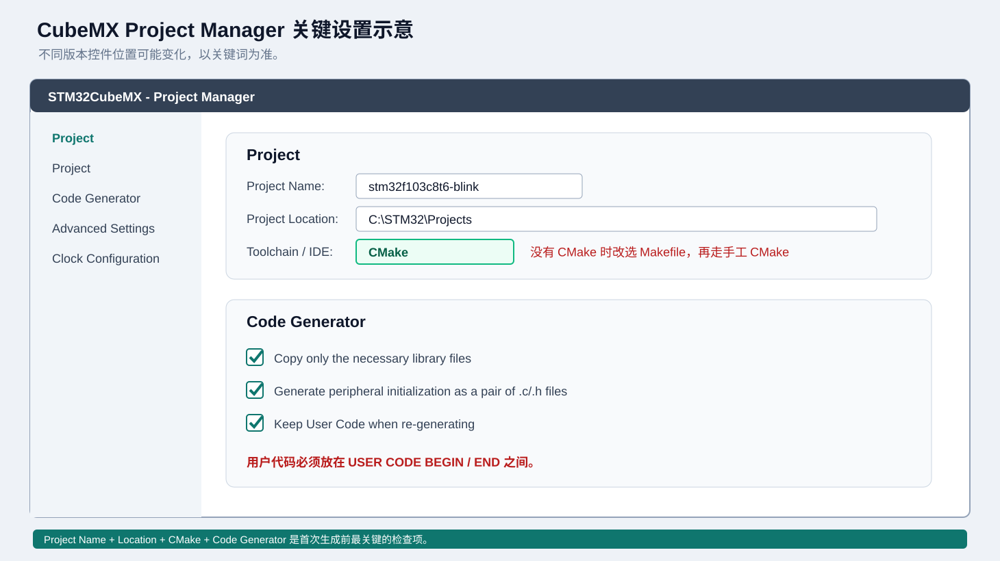

# 02 使用 STM32CubeMX 新建工程

[上一章：安装工具](./01-install-tools.md) | [返回主页](../README.md) | [下一章：配置 VS Code](./03-vscode-project.md)

这一章创建一个最小的 STM32F103C8T6 工程：

- 使用外部 8 MHz 晶振。
- 系统时钟配置为 72 MHz。
- 打开 SWD 调试引脚。
- 配置 `PC13` 为推挽输出，用于驱动 Blue Pill 板载 LED。
- 使用 CubeMX 的 `CMake` 工具链生成工程。

## 1. 先确定目标芯片和开发板

本教程示例：

| 项目 | 值 |
| --- | --- |
| MCU | STM32F103C8T6 |
| 内核 | ARM Cortex-M3 |
| Flash | 64 KB |
| RAM | 20 KB |
| 外部晶振 | 8 MHz |
| 系统时钟 | 72 MHz |
| 调试接口 | SWD |
| 示例 LED | PC13 |

如果你使用的是其他芯片：

1. 在 CubeMX 中选择自己的芯片。
2. 保留整套操作流程。
3. 从 CubeMX 生成的链接脚本中读取真实的 Flash/RAM 大小。
4. 修改 `CMakeLists.txt` 中的 CPU、宏定义和链接脚本参数。
5. 修改 OpenOCD target 文件。

不要直接把 F103 的 `-mcpu=cortex-m3 -mthumb` 和链接脚本复制到 F4、G0、H7 工程。

## 2. 启动 CubeMX

打开 STM32CubeMX，等待首页加载。

首页通常有几种入口：

```text
New Project
Open Existing Project
Recent Projects
```

选择 `New Project`，然后进入 MCU/Board Selector。

## 3. 选择芯片

### 3.1 使用 MCU Selector

1. 在搜索框输入 `STM32F103C8`。
2. 在结果中选择 `STM32F103C8Tx`。
3. 右侧确认封装，例如 `LQFP48`。
4. 点击 `Start Project` 或双击芯片。

### 3.2 使用 Board Selector

如果使用官方 Nucleo 或 Discovery 板，可以在 `Board Selector` 中选择具体板卡。板卡模式下 CubeMX 会自动预置部分引脚，但不同板卡的 LED 引脚和调试器型号不同。

Blue Pill 属于第三方小板，通常直接用 `MCU Selector` 更稳妥。

## 4. 配置调试接口

在左侧 `Pinout & Configuration` 中展开：

```text
System Core
  -> SYS
```

把 `Debug` 设置为：

```text
Serial Wire
```

此时芯片的以下引脚会自动分配：

| 引脚 | 功能 |
| --- | --- |
| PA13 | SWDIO |
| PA14 | SWCLK |

不要在没有替代调试接口的情况下把 `Debug` 设置为 `Disable`。否则重新烧录或调试时会非常麻烦，可能需要用 BOOT 模式或专用工具恢复。

## 5. 配置外部晶振

展开：

```text
System Core
  -> RCC
```

把：

```text
High Speed Clock (HSE)
```

设置为：

```text
Crystal/Ceramic Resonator
```

这表示开发板上安装了外部高速晶振。常见 Blue Pill 使用 8 MHz 晶振。

如果开发板没有外部晶振，则保留 `Disable`，使用内部 HSI，并相应调整时钟树。

## 6. 配置 LED 引脚

### 6.1 选择 PC13

在芯片图上找到 `PC13`：

1. 左键点击 `PC13`。
2. 选择 `GPIO_Output`。
3. 右键点击已变成绿色的 `PC13`，选择 `Enter User Label`。
4. 输入：

   ```text
   USER_LED
   ```

### 6.2 设置 GPIO 参数

展开：

```text
System Core
  -> GPIO
```

点击 `PC13`，参考配置：

| 参数 | 值 |
| --- | --- |
| GPIO output level | High |
| GPIO mode | Output Push Pull |
| GPIO Pull-up/Pull-down | No pull-up and no pull-down |
| Maximum output speed | Low |
| User Label | USER_LED |

Blue Pill 的板载 LED 通常是低电平点亮，所以初始化时先设置为 `High`，可以避免上电瞬间亮一下。

### 6.3 Nucleo 板注意事项

Nucleo 板载 LED 常见引脚是 `PA5`、`PB0`、`PC13` 或 `LD1/LD2`。具体以板卡原理图为准，不能照搬 Blue Pill。

## 7. 配置时钟树

打开 `Clock Configuration`。

对于 STM32F103C8T6 + 8 MHz HSE，常见目标是：

```text
HSE = 8 MHz
PLL Source = HSE
PLL MUL = x9
SYSCLK = 72 MHz
AHB Prescaler = /1
APB1 Prescaler = /2
APB2 Prescaler = /1
```

典型结果：

| 时钟 | 频率 |
| --- | --- |
| SYSCLK | 72 MHz |
| HCLK | 72 MHz |
| PCLK1 | 36 MHz |
| PCLK2 | 72 MHz |

在 CubeMX 中，先选择 `HSE` 作为 PLL Source，再设置 PLL 倍频，最后调整 AHB/APB 分频器。界面会用红色提示非法频率，必须解决后再生成代码。

### 7.1 为什么 APB1 是 36 MHz

STM32F103 的 APB1 最大频率通常为 36 MHz。把 APB1 设置为 `/2`，即可将 72 MHz 降到 36 MHz。

不同 STM32 系列的最大频率不同，必须以数据手册和 CubeMX 校验结果为准。

## 8. 配置 Project Manager

点击 `Project Manager`。



### 8.1 Project 页面

设置：

| 字段 | 示例 |
| --- | --- |
| Project Name | `stm32f103c8t6-blink` |
| Project Location | `C:\STM32\Projects` |
| Application Structure | `Advanced` |
| Toolchain / IDE | `CMake` |
| Firmware Package | 已安装的 STM32F1 包 |

`Project Location` 是父目录。CubeMX 通常会在它下面创建：

```text
C:\STM32\Projects\stm32f103c8t6-blink
```

最终打开 VS Code 的目录应该是这个完整工程目录，而不是 `C:\STM32\Projects`。

### 8.2 Code Generator 页面

勾选：

```text
Copy only the necessary library files
Generate peripheral initialization as a pair of .c/.h files
Keep User Code when re-generating
```

说明：

| 选项 | 作用 |
| --- | --- |
| Copy only necessary library files | 只复制用到的 HAL 文件，工程更小 |
| Generate peripheral initialization as pair of .c/.h files | 把外设初始化拆成独立文件，结构更清晰 |
| Keep User Code when re-generating | 保留 `USER CODE BEGIN/END` 之间的代码 |

如果你的 CubeMX 没有 `CMake` 选项，先使用 `Makefile` 生成，再按照 [05 CMake 模板详解](./05-cmake-template.md) 添加手工 CMake。不要在 Project Manager 页面随便选择不认识的 IDE。

## 9. 生成代码

点击右上角：

```text
GENERATE CODE
```

第一次生成可能需要等待固件包解压。

生成完成后，CubeMX 通常会询问是否打开 IDE，选择 `Open Project` 或直接关闭并手动用 VS Code 打开工程目录。

### 9.1 生成后的检查点

进入工程目录，至少应看到：

```text
stm32f103c8t6-blink.ioc
Core/
Drivers/
cmake/
CMakeLists.txt
```

如果使用官方 CMake 生成器，还可能看到：

```text
CMakePresets.json
cmake/gcc-arm-none-eabi.cmake
cmake/stm32cubemx/CMakeLists.txt
```

具体文件名随 CubeMX 版本变化，以实际生成结果为准。

## 10. 找到用户代码区

打开：

```text
Core/Src/main.c
```

在 `main()` 内部找到：

```c
/* USER CODE BEGIN 2 */

/* USER CODE END 2 */
```

和：

```c
/* USER CODE BEGIN WHILE */
while (1)
{
  /* USER CODE END WHILE */

  /* USER CODE BEGIN 3 */
}
/* USER CODE END 3 */
```

只在 `USER CODE BEGIN` 和 `USER CODE END` 之间写代码。

例如，让 Blue Pill LED 每 500 ms 翻转一次：

```c
/* USER CODE BEGIN WHILE */
while (1)
{
  HAL_GPIO_TogglePin(USER_LED_GPIO_Port, USER_LED_Pin);
  HAL_Delay(500);

  /* USER CODE END WHILE */

  /* USER CODE BEGIN 3 */
}
/* USER CODE END 3 */
```

`USER_LED_GPIO_Port` 和 `USER_LED_Pin` 是 CubeMX 根据 User Label 生成的宏，通常在 `main.h` 中定义。

## 11. 第一次命令行构建

在工程目录打开 PowerShell：

```powershell
cd C:\STM32\Projects\stm32f103c8t6-blink
cmake --preset debug
cmake --build --preset debug
```

如果这是 CubeMX 新生成的 CMake 工程，可能还没有本仓库提供的 `CMakePresets.json`。这时先查看项目自带文档或 `CMakeLists.txt`，也可以先复制模板：

```powershell
Copy-Item C:\path\to\tutorial\templates\CMakePresets.json .
Copy-Item C:\path\to\tutorial\templates\cmake\gcc-arm-none-eabi.cmake .\cmake\ -Force
```

然后重新运行：

```powershell
cmake --preset debug
cmake --build --preset debug
```

如果构建成功，在 `build/Debug/` 中查找：

```powershell
Get-ChildItem .\build\Debug -Filter *.elf
Get-ChildItem .\build\Debug -Filter *.hex
Get-ChildItem .\build\Debug -Filter *.bin
```

如果这里失败，不要继续调试硬件。先进入 [06 故障排查](./06-troubleshooting.md) 的“构建失败”部分。

## 12. 重新生成工程时要记住什么

以后修改 `.ioc` 后，CubeMX 会重新生成代码。原则：

1. 自己的代码必须放在 `USER CODE BEGIN/END` 之间。
2. 不要在 `Drivers/` 中写业务代码。
3. 不要手动修改 CubeMX 生成的 `cmake/stm32cubemx/CMakeLists.txt`，除非你知道它的覆盖规则。
4. 每次重新生成后，先检查 `git diff`。
5. 把 `.ioc`、`Core/`、`Drivers/`、`CMakeLists.txt` 的改动一起提交。

推荐在重新生成前先提交一次：

```powershell
git status
git add .
git commit -m "chore: save code before CubeMX regeneration"
```

## 13. 本章完成标准

- [ ] CubeMX 能选择 `STM32F103C8Tx`。
- [ ] `SYS -> Debug` 已选择 `Serial Wire`。
- [ ] `RCC -> HSE` 已选择 `Crystal/Ceramic Resonator`。
- [ ] `PC13` 已配置为 `GPIO_Output`，User Label 为 `USER_LED`。
- [ ] 时钟树显示 72 MHz，无红色错误。
- [ ] `Toolchain / IDE` 选择 `CMake`。
- [ ] 已生成 `Core/`、`Drivers/`、`.ioc` 和 CMake 工程文件。
- [ ] 至少完成过一次 CMake 配置和构建。

下一章：[03 配置 VS Code 工程](./03-vscode-project.md)
