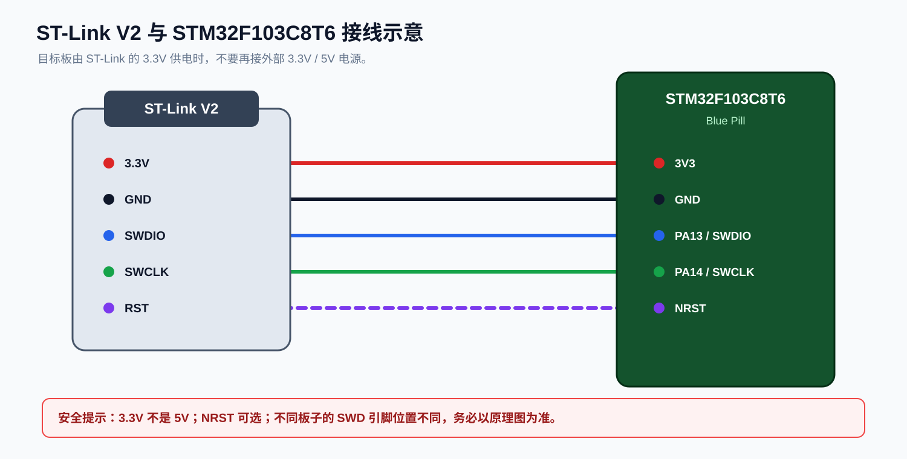

# 04 构建、烧录与调试

[上一章：配置 VS Code](./03-vscode-project.md) | [返回主页](../README.md) | [下一章：CMake 模板详解](./05-cmake-template.md)

这一章完成从源码到开发板的完整闭环：

```text
源码 -> CMake 配置 -> GCC 编译/链接 -> ELF
  -> OpenOCD -> ST-Link -> SWD -> STM32
  -> Cortex-Debug -> 断点/变量/寄存器
```

任何一步失败，都先解决当前步骤，不要直接跳到下一步。

## 1. 构建 Debug 固件

在工程根目录打开 PowerShell：

```powershell
cd C:\STM32\Projects\stm32f103c8t6-blink
cmake --preset debug
cmake --build --preset debug
```

如果这是第一次配置，CMake 会：

1. 读取 `CMakePresets.json`。
2. 选择 Ninja 生成器。
3. 加载 `cmake/gcc-arm-none-eabi.cmake`。
4. 找到 `arm-none-eabi-gcc` 和 `arm-none-eabi-g++`。
5. 生成 `build/Debug/build.ninja`。
6. 创建 `compile_commands.json`。

构建最后应看到类似：

```text
[1/5] Building C object ...
[5/5] Linking C executable stm32f103c8t6-blink.elf
Memory region         Used Size  Region Size  %age Used
           FLASH:        ...
             RAM:        ...
```

具体进度编号取决于工程文件数量。

## 2. 理解构建产物

进入 build 目录：

```powershell
Get-ChildItem .\build\Debug | Select-Object Name,Length,LastWriteTime
```

常见文件：

| 文件 | 作用 |
| --- | --- |
| `.elf` | 带符号和调试信息的可执行文件，调试必须用它 |
| `.hex` | Intel HEX 格式，适合 STM32CubeProgrammer、烧录器 |
| `.bin` | 原始二进制，只有字节内容，没有符号 |
| `.map` | 链接映射，查看代码、变量、Flash/RAM 占用 |
| `.elf` 对应的 `.list` | 反汇编清单，部分模板会生成 |
| `compile_commands.json` | 给 C/C++ IntelliSense 使用的真实编译命令 |
| `build.ninja` | Ninja 构建描述，不要手动修改 |

查找 ELF：

```powershell
Get-ChildItem .\build -Recurse -Filter *.elf |
  Select-Object FullName,LastWriteTime
```

如果没有 `.elf`，不要继续接线和调试。

## 3. 查看固件大小

```powershell
arm-none-eabi-size .\build\Debug\stm32f103c8t6-blink.elf
```

输出通常包括：

```text
text    data     bss     dec     hex filename
...
```

| 段 | 大致含义 |
| --- | --- |
| `text` | Flash 中的代码和只读数据 |
| `data` | 有初值的全局/静态变量，运行时复制到 RAM |
| `bss` | 无初值或初值为 0 的全局/静态变量 |
| `dec` | 十进制总量 |
| `hex` | 十六进制总量 |

评估 Flash 和 RAM 时，不要只看 `text`：

```text
Flash 占用通常约为 text + data
RAM 占用通常约为 data + bss
```

最终仍应以链接器输出的 Memory region 和 `.map` 文件为准。

## 4. 生成 HEX 和 BIN

如果 CMake 模板已经配置了 post-build 命令，构建后自动生成。否则手工执行：

```powershell
arm-none-eabi-objcopy `
  -O ihex `
  .\build\Debug\stm32f103c8t6-blink.elf `
  .\build\Debug\stm32f103c8t6-blink.hex

arm-none-eabi-objcopy `
  -O binary `
  .\build\Debug\stm32f103c8t6-blink.elf `
  .\build\Debug\stm32f103c8t6-blink.bin
```

再次强调：

```text
烧录可以用 ELF、HEX 或 BIN。
调试用 ELF。
```

## 5. 连接硬件



### 5.1 ST-Link 与 Blue Pill

常见接线：

| ST-Link | STM32F103C8T6 | 是否必需 |
| --- | --- | --- |
| `3.3V` | `3V3` | 使用 ST-Link 供电时必需 |
| `GND` | `GND` | 必需 |
| `SWDIO` | `PA13` | 必需 |
| `SWCLK` | `PA14` | 必需 |
| `RST` | `NRST` | 可选，连接不稳定时建议接 |

### 5.2 供电规则

以下情况只能选择一个：

1. ST-Link 的 `3.3V` 给目标板供电。
2. 目标板通过自己的 USB 或外部 3.3V 电源供电。

不要让 ST-Link 和目标板电源同时向同一个 `3V3` 网络强推电流。

### 5.3 不要接 5V

不要把 ST-Link 的 `5V` 接到 STM32 的 `3V3`。STM32 通常是 3.3 V 器件，5 V 直接接入会损坏芯片或调试器。

### 5.4 BOOT 跳线

正常从 Flash 启动时：

```text
BOOT0 = 0
BOOT1 = 0
```

如果误改 BOOT 跳线，程序可能没有从预期的 Flash 启动。只有在无法连接或需要进入系统 Bootloader 时才临时调整 BOOT0，调整后要复位并确认目标状态。

## 6. 先单独测试 OpenOCD

不要把 VS Code 当成第一层调试工具。先在 PowerShell 测试 OpenOCD：

```powershell
openocd `
  -s "C:\Tools\xpack-openocd\openocd\scripts" `
  -f "openocd\stm32f1-stlink.cfg" `
  -c "init; targets; shutdown"
```

如果 `-s` 后面的目录不存在，先从 OpenOCD 安装目录中查找：

```powershell
Get-ChildItem -Recurse C:\Tools -Filter stm32f1x.cfg -ErrorAction SilentlyContinue |
  Select-Object FullName
```

成功的输出通常会看到：

```text
Info : STLINK ...
Info : swd
Info : stm32f1x.cpu: hardware has 6 breakpoints...
```

失败时：

```text
Error: open failed
Error: No STM32 target found
Error: target voltage may be too low
Error: couldn't open ... stlink.cfg
```

先解决这里，再启动 VS Code 调试。

## 7. 使用 OpenOCD 烧录

### 7.1 烧录 ELF

在工程根目录运行：

```powershell
openocd `
  -s "C:\Tools\xpack-openocd\openocd\scripts" `
  -f "openocd\stm32f1-stlink.cfg" `
  -c "program build/Debug/stm32f103c8t6-blink.elf verify reset exit"
```

各参数含义：

| 参数 | 含义 |
| --- | --- |
| `program` | 烧录文件并校验 |
| `verify` | 写完后校验 Flash |
| `reset` | 重置并运行目标 |
| `exit` | 完成后退出 OpenOCD |

使用 HEX：

```powershell
openocd `
  -s "C:\Tools\xpack-openocd\openocd\scripts" `
  -f "openocd\stm32f1-stlink.cfg" `
  -c "program build/Debug/stm32f103c8t6-blink.hex verify reset exit"
```

### 7.2 只擦除和复位

谨慎使用擦除命令，它会删除目标 Flash 中的程序：

```powershell
openocd `
  -s "C:\Tools\xpack-openocd\openocd\scripts" `
  -f "openocd\stm32f1-stlink.cfg" `
  -c "init; reset halt; stm32f1x mass_erase 0; reset run; shutdown"
```

只有确认目标是当前开发板时才执行。

### 7.3 烧录后没反应

如果是 Blue Pill `PC13` LED：

1. 确认代码确实调用了 `HAL_GPIO_TogglePin()`。
2. 确认 `USER_LED_GPIO_Port` 是 `GPIOC`，`USER_LED_Pin` 是 `GPIO_PIN_13`。
3. 确认 LED 是低电平点亮，初始化时先设为 High。
4. 确认程序没有停在 HardFault。
5. 用调试器暂停后查看 `PC` 是否还停留在 `main()` 的循环中。

## 8. 使用 VS Code 启动调试

### 8.1 确认 launch.json

调试配置中的 ELF 必须和实际文件一致：

```json
"executable": "${workspaceFolder}/build/Debug/stm32f103c8t6-blink.elf"
```

如果你改过工程名，必须一起改。

### 8.2 启动

1. 打开 `Core/Src/main.c`。
2. 在 `HAL_GPIO_TogglePin(...)` 前一行点击左侧行号区域设置断点。
3. 按 `F5`。
4. 选择：

   ```text
   Debug (OpenOCD + ST-Link)
   ```

5. 等待 OpenOCD 连接、下载程序并停在断点。

启动后 VS Code 左侧通常会出现：

| 视图 | 用途 |
| --- | --- |
| VARIABLES | 局部变量、全局变量 |
| WATCH | 手动监视表达式 |
| CALL STACK | 函数调用关系 |
| BREAKPOINTS | 管理断点 |
| XPERIPHERALS | 查看外设寄存器 |
| REGISTERS | 查看 CPU 寄存器 |

### 8.3 调试按钮

| 操作 | 常用快捷键 | 含义 |
| --- | --- | --- |
| Continue | `F5` | 继续运行 |
| Step Over | `F10` | 单步跳过函数 |
| Step Into | `F11` | 进入函数 |
| Step Out | `Shift+F11` | 跳出当前函数 |
| Restart | `Ctrl+Shift+F5` | 重新启动调试 |
| Stop | `Shift+F5` | 停止调试 |

## 9. 断点、变量和调用栈

### 9.1 设置条件断点

1. 右键点击断点。
2. 选择 `Edit Breakpoint`。
3. 输入条件，例如：

   ```text
   i == 10
   ```

4. 程序只在条件成立时停下。

### 9.2 监视变量

在 `WATCH` 区域添加：

```text
HAL_GetTick()
GPIOA->ODR
GPIOC->IDR
```

如果表达式显示 `optimized out`，通常是编译优化导致的。Debug 配置建议使用 `-Og` 或 `-O0`，不要一开始就用 `-O2`。

### 9.3 查看调用栈

程序停在函数内部时，`CALL STACK` 会显示调用链。点击某一层可以切换对应的局部变量和源码位置。

中断服务函数里出现异常调用栈时，先确认是否发生了 HardFault、栈溢出或空指针访问。

## 10. 查看寄存器

### 10.1 CPU 寄存器

调试时查看：

```text
PC
SP
LR
xPSR
```

判断程序是否跑飞时：

1. 暂停 CPU。
2. 查看 `PC` 落在哪里。
3. 对照 `.map` 或反汇编确认它在哪个函数附近。

### 10.2 外设寄存器

如果想在 VS Code 中图形化查看外设，可以给 Cortex-Debug 配置 SVD 文件：

```json
"svdFile": "${workspaceFolder}/.vscode/STM32F103xx.svd"
```

SVD 文件可以从 STM32Cube 固件包、CMSIS Device Pack 或芯片厂商资料中获取。文件名必须和实际文件一致。

没有 SVD 也可以调试，只是 `XPERIPHERALS` 不会显示外设视图。

## 11. 使用 GDB 控制台

Cortex-Debug 启动后，在 `DEBUG CONSOLE` 中可以使用常见 GDB 命令：

```gdb
monitor reset halt
info registers
bt
print HAL_GetTick()
x/16wx 0x20000000
continue
```

注意：

- `monitor ...` 命令会转发给 OpenOCD。
- `print`、`bt`、`x` 是 GDB 命令。
- 长时间单步运行会明显变慢，这是正常现象。

## 12. 重新编译和重新烧录

调试前修改代码后：

1. 停止当前调试会话。
2. 运行 `CMake: build (Debug)`。
3. 再次按 `F5`。

如果配置了：

```json
"preLaunchTask": "CMake: build (Debug)"
```

按 `F5` 会先自动构建，再启动调试。

不要在没有停止调试时反复烧录同一个 ELF，否则容易看到“文件被占用”或目标状态混乱。

## 13. 不同调试器的 OpenOCD 接口

ST-Link 示例：

```tcl
source [find interface/stlink.cfg]
transport select swd
```

CMSIS-DAP 示例：

```tcl
source [find interface/cmsis-dap.cfg]
transport select swd
```

J-Link 通常使用：

```text
servertype: jlink
device: STM32F103C8
```

不同接口不一定都要经过 OpenOCD。Cortex-Debug 支持多种 server，但本教程主线是 OpenOCD。

## 14. 调试模式与烧录模式

### 14.1 launch

```json
"request": "launch"
```

表示：

- 重新下载程序。
- 重置目标。
- 停在入口或断点。

适合日常开发。

### 14.2 attach

```json
"request": "attach"
```

表示：

- 不重新烧录，连接到已经运行的 CPU。
- 用于分析现场问题。

但 `preLaunchTask` 不会替代烧录。使用 `attach` 前，目标上必须已经有正确的程序。

## 15. 调试时最重要的检查清单

- [ ] `arm-none-eabi-gcc --version` 正常。
- [ ] `cmake --preset debug` 正常。
- [ ] `cmake --build --preset debug` 正常。
- [ ] ELF 路径和 `launch.json` 完全一致。
- [ ] ST-Link 的 3.3V、GND、SWDIO、SWCLK 已连接。
- [ ] 目标没有由多个电源同时供电。
- [ ] ST-Link 驱动正常。
- [ ] OpenOCD 单独运行能识别目标。
- [ ] VS Code 选择的是 Cortex-Debug 配置。
- [ ] 程序停在断点时，`CALL STACK` 显示合理调用链。

## 16. 下一步

如果现在能够构建、烧录和断点调试，已经完成了本教程的主线。

继续阅读：

- [05 CMake 模板详解](./05-cmake-template.md)：理解为什么能编译。
- [06 故障排查](./06-troubleshooting.md)：处理具体错误。
- [07 命令速查表](./07-cheatsheet.md)：日常开发快速复制命令。
