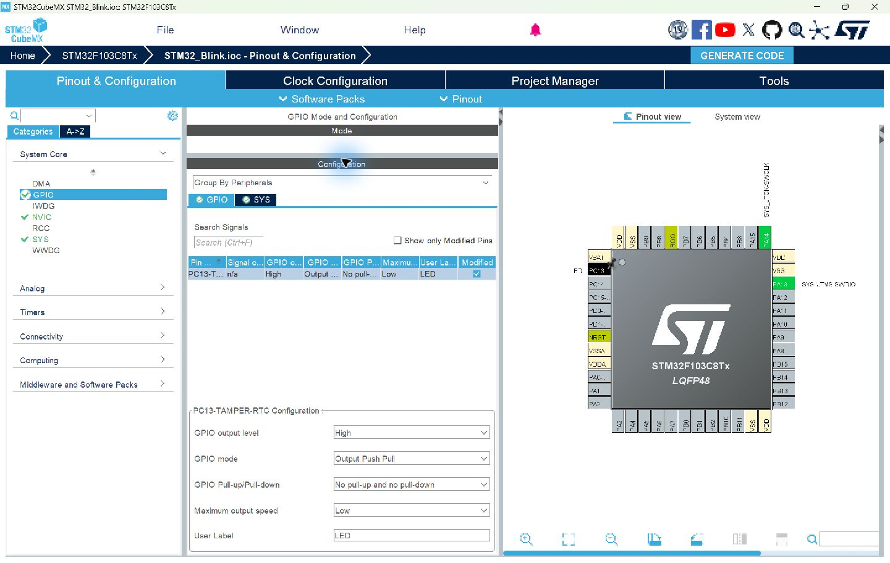
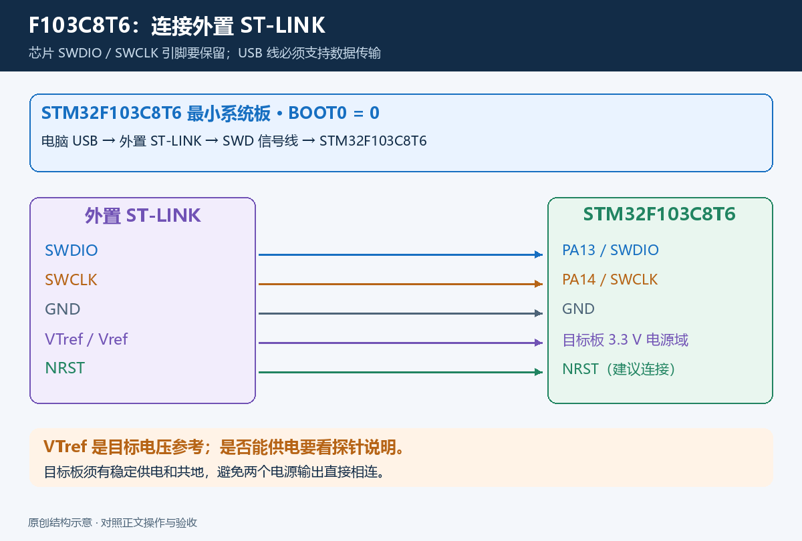
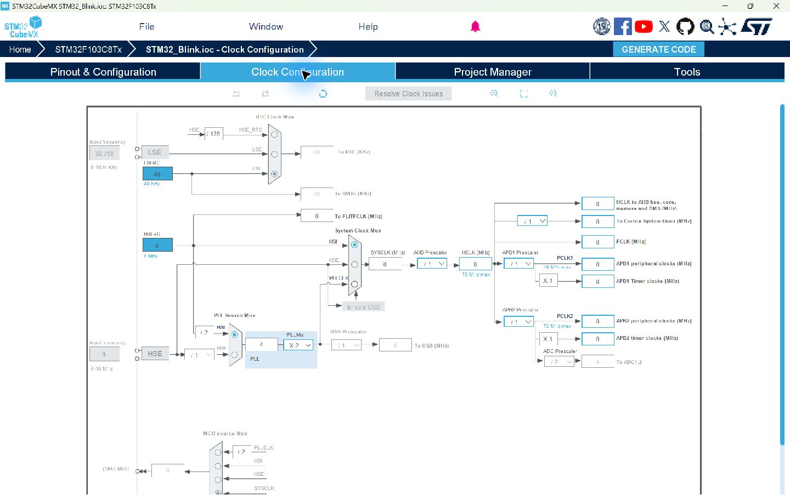

# STM32F103C8T6：板级检查与 72 MHz 时钟补充

[返回主教程](../README.md)

主教程已经完整使用 STM32F103C8T6。本页补充最小系统板的硬件检查，以及完成 HSI 8 MHz 示例后，如何配置常见的 HSE 8 MHz → PLL 72 MHz 方案。

## 1. 先确认手里的板子

| 核对项 | 本教程的假定 | 怎么确认 |
|---|---|---|
| 芯片 | STM32F103C8T6，LQFP48 | 看芯片丝印与原理图，CubeMX 选相同型号 |
| CPU | Cortex-M3，无硬件 FPU | 编译配置应对应 `cortex-m3` |
| Flash / SRAM | 64 KB / 20 KB | 查看生成链接脚本的 MEMORY 段 |
| 用户 LED | PC13，低电平亮 | 查原理图；区分用户 LED 和电源灯 |
| 电源 | 芯片电源域为 3.3 V | 核对板载稳压器、输入端和电源针脚 |
| 下载调试 | 外置 ST-LINK，通过 SWD | PA13 = SWDIO、PA14 = SWCLK、共地 |
| 启动 | BOOT0 = 0 | 查看跳线位置与原理图 |
| 外部高速晶振 | 72 MHz 方案假定装有 8 MHz 晶振 | 看元件标记与原理图 |

C8 的官方容量为 64 KB Flash、20 KB SRAM。即使一些板子实际表现出更大容量，也应按标称容量建立可分发的工程。[ST 数据手册](https://www.st.com/resource/en/datasheet/stm32f103c8.pdf)

### CubeMX 里为什么显示 C8Tx 或 C(8-B)Tx

MCU Selector 中用完整订货型号 **STM32F103C8T6** 搜索。工程标题可能显示 `STM32F103C8Tx`，数据库名称可能显示 `STM32F103C(8-B)Tx`；这些是工具的型号分组写法。最终核对所选 C8 型号、LQFP48 封装与链接脚本的内存容量。

启动文件名可能是 `startup_stm32f103xb.s`，CMSIS 芯片宏可能是 `STM32F103xB`。这些名称覆盖相应中容量器件，不能仅看到 `B` 就判断生成了错误的 128 KB 工程。**容量由链接脚本和实际芯片规格共同核对。**

## 2. PC13 LED 怎么判断亮灭

本文采用常见的接法：

```text
3.3 V ── 限流电阻 ── LED 阳极 → LED 阴极 ── PC13

PC13 = 0：电流流入 PC13，LED 亮
PC13 = 1：LED 灭
```

CubeMX 中选择 PC13 / PC13-TAMPER-RTC → GPIO_Output，设置为推挽、无上下拉、Low（2 MHz）、初始 High、User Label = LED。



`HAL_GPIO_TogglePin()` 每次反转电平，能够直接用于本文的亮灭演示。以后写固定亮/灭函数时，要按低电平有效处理。

PC13/PC14/PC15 有特殊电气限制：输出速度不超过 2 MHz，驱动电流限制为 3 mA，最大负载为 30 pF；不能用这组引脚向 LED 等负载提供电流。本文接法让 PC13 灌电流，使用限流电阻。设计自己的板子时核对电流与负载，较大负载使用独立驱动电路。[ST 引脚表与 GPIO 电气特性](https://www.st.com/resource/en/datasheet/stm32f103c8.pdf)

## 3. BOOT0 和 USB 接口

正常运行本文的 Flash 程序时，**BOOT0 = 0**。BOOT0 为 1 会改变复位后的启动来源，可能出现“烧录成功，按复位后 LED 没运行”。有 BOOT1 跳线时按板级常规运行配置设置。

SWD 下载本身不要求将 BOOT0 设为 1。本文从工程生成到下载均使用外置 ST-LINK。

板上 USB 接口、供电入口和外置探针是不同部分。板上 USB 能供电，不等于已经具备本文的下载和断点调试能力。将外置 ST-LINK 的 USB 接到电脑，再连接 SWD 信号线。



供电和目标电压参考按探针定义接。完整探针通常提供 VTref 输入，一些小型 ST-LINK 的 `3.3V` 则是电源输出；不能直接按同一个意义接线。目标独立供电时保持共地，避免两个电源输出直接相连。

## 4. HSI 8 MHz 为什么作为起点

HSI 是芯片内部振荡器，不依赖板上外部晶振。先用它验证编辑、编译、SWD 下载和断点调试，能让第一次搭建的步骤更清晰。

主教程使用：HSI 8 MHz → SYSCLK 8 MHz → AHB /1 → HCLK 8 MHz，APB1/APB2 均 /1。LED 的 500 ms 间隔由 HAL 毫秒时基计算。



8 MHz 是本例的系统时钟；GPIO 页面中的 Low / 2 MHz 是引脚输出速度等级，不是主频，也不是每秒闪烁次数。

<a id="clock-72mhz"></a>
## 5. 可选：HSE 8 MHz → PLL 72 MHz

**前提：**8 MHz 示例已完成验收，原理图确认板上有可用的 8 MHz 高速晶振。先保存 `.ioc` 和源码，再修改时钟配置。

### 5.1 在 RCC 启用 HSE

打开 **Pinout & Configuration → System Core → RCC**，将 **High Speed Clock (HSE)** 设为 **Crystal/Ceramic Resonator**，适用于板上的无源晶振。

若实际硬件提供有源时钟输入，则按电路选择 **Bypass Clock Source**，并填写实际输入频率。

### 5.2 在 Clock Configuration 填写参数

| 时钟树位置 | 设置值 | 计算结果 |
|---|---|---|
| Input frequency / HSE | 8 MHz | 外部输入 8 MHz |
| PLL Source Mux | HSE | PLL 使用外部高速时钟 |
| HSE 到 PLL 的分频 | /1 | PLL 输入 8 MHz |
| PLL multiplier | ×9 | PLLCLK = 8 × 9 = 72 MHz |
| System Clock Mux | PLLCLK | SYSCLK = 72 MHz |
| AHB Prescaler | /1 | HCLK = 72 MHz |
| APB1 Prescaler | /2 | PCLK1 = 36 MHz |
| APB2 Prescaler | /1 | PCLK2 = 72 MHz |
| ADC Prescaler | /6 或 /8 | 若启用 ADC，时钟为 12 或 9 MHz，不超过 14 MHz |

```text
HSE 8 MHz → /1 → PLL ×9 → 72 MHz → SYSCLK → AHB /1 → HCLK 72 MHz
                                                     ├─ APB1 /2 → 36 MHz
                                                     └─ APB2 /1 → 72 MHz
```

APB1 上限是 36 MHz，HCLK 为 72 MHz 时不能仍将 APB1 设为 /1。APB 分频不为 1 时，对应定时器时钟通常为 PCLK 的 2 倍：本方案 APB1 定时器为 72 MHz。USB 若另行启用还需要 48 MHz 时钟；本文 LED 工程无需启用 USB。[ST 时钟树与频率限制](https://www.st.com/resource/en/datasheet/stm32f103c8.pdf)

按时钟树从左到右核对输入源、PLL 倍频、SYSCLK 选择和相关分频，确保没有未解决的错误。仅把一个输出框填成 72，不代表整个时钟树已经配置正确。

### 5.3 重新生成、构建与下载

1. 确认 **SYS → Debug = Serial Wire** 与 PC13 配置仍保留。
2. 保存 `.ioc`，点击 **GENERATE CODE**。
3. 检查 `SystemClock_Config()` 使用 HSE、PLL ×9、SYSCLK = PLLCLK、APB1 /2。在本例 3.3 V 供电下，72 MHz 的 Flash 等待周期应由 CubeMX 配成 2。
4. 在 VS Code 重新 Configure、Build，再通过 ST-LINK 下载。
5. 用调试器观察 `SystemCoreClock`，应为 `72000000`。它是软件记录值，需结合时钟配置与硬件状态判断。
6. LED 仍应约每 500 ms 切换；HAL 时基应随着时钟配置正确初始化。

若进入 `Error_Handler()`，先看是在 `HAL_RCC_OscConfig()` 还是 `HAL_RCC_ClockConfig()` 后失败，再检查晶振、HSE 模式、输入频率和分频。改回主教程 HSI 配置可以帮助定位外部时钟问题。

本次实际编译验证覆盖 **HSI 8 MHz** 工程。72 MHz 为补充步骤，尚未进行板上时钟与运行验证。范围见 [验证记录](verification.md)。

## 6. F103C8T6 专项排查

| 现象 | 优先检查 |
|---|---|
| ST-LINK 可识别，目标连接失败 | 供电、共地、SWDIO/SWCLK、Serial Wire、NRST、探针占用 |
| 下载后正常，按复位没运行 | BOOT0 = 0、复位信号、异常处理 |
| LED 状态与预期相反 | PC13 是否低电平点亮，是否观察了用户 LED |
| 启用 HSE 后卡住 | 板上晶振与频率、Crystal/Bypass 模式、PLL 配置 |
| 72 MHz 时钟树报错 | APB1 /2、ADC 分频和其他外设时钟限制 |
| Flash 溢出 | C8 的 64 KB 规格、代码体积和链接脚本 |
| 编译报告 FPU 参数不适用 | Cortex-M3 无 FPU，检查工程是否正确生成 |
| 同外观板子调试 ID 不同 | 核对真实芯片厂商与型号，使用对应工具支持 |
